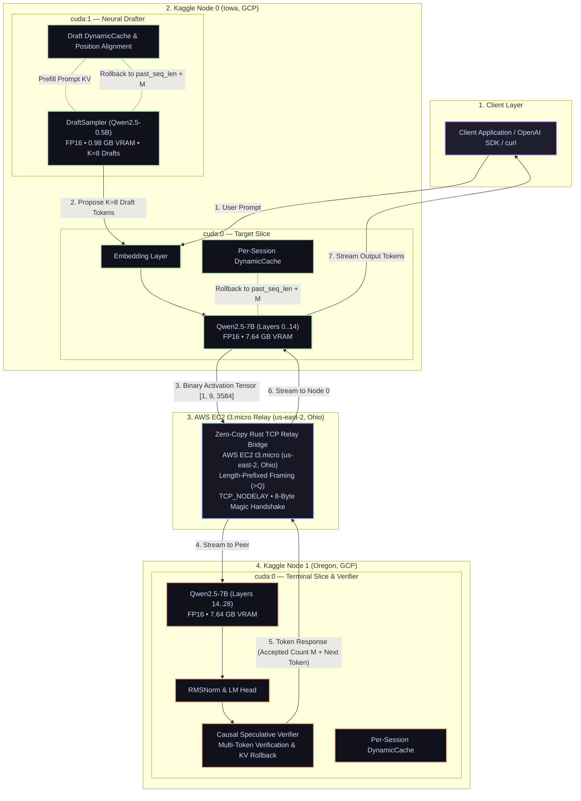
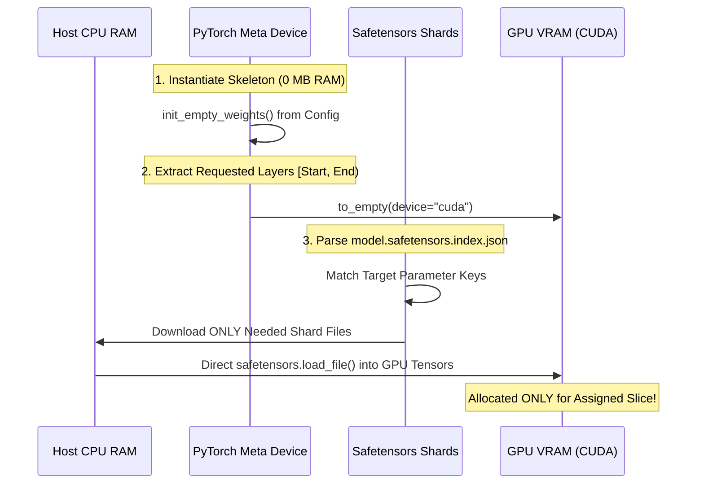
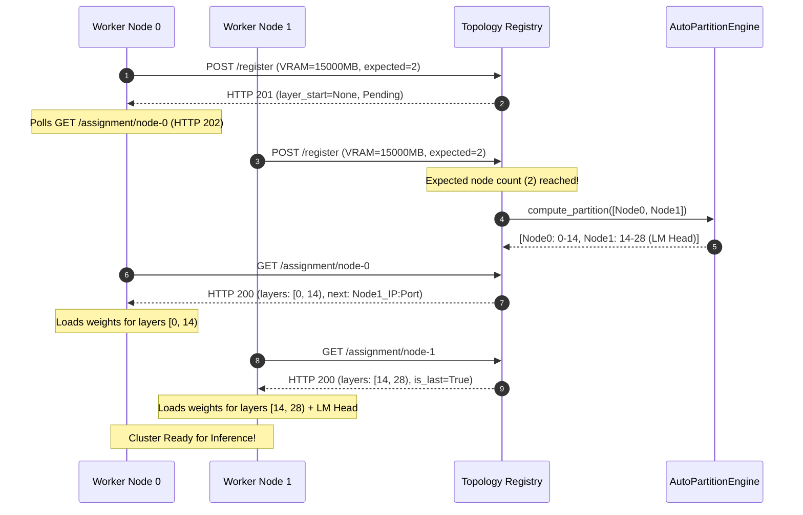

# ShardFlow: Complete System Architecture & Engineering Specification

> **System Version:** 2.0.0 (v2 Data/Control Plane Architecture)  
> **Status:** Production-Verified Distributed LLM Inference  
> **Target Deployments:** Heterogeneous Cloud/Consumer GPUs (Google Colab T4, Kaggle P100/T4, RunPod, Lambda Labs, Local GPUs) + Zero-Cost Control Plane (Render / FastAPI)

---

## Table of Contents

1. [Executive Summary & Core Philosophy](#1-executive-summary--core-philosophy)
2. [High-Level System Architecture](#2-high-level-system-architecture)
3. [Control Plane Subsystems](#3-control-plane-subsystems)
   - [3.1 API Gateway (`shardflow.gateway`)](#31-api-gateway-shardflowgateway)
   - [3.2 Request Scheduler & Session Manager (`shardflow.scheduler`)](#32-request-scheduler--session-manager-shardflowscheduler)
   - [3.3 Dynamic Topology Registry (`shardflow.registry`)](#33-dynamic-topology-registry-shardflowregistry)
   - [3.4 Auto-Partitioning Engine (`shardflow.partition`)](#34-auto-partitioning-engine-shardflowpartition)
   - [3.5 Zero-Weight Inference Orchestrator (`shardflow.orchestrator`)](#35-zero-weight-inference-orchestrator-shardfloworchestrator)
4. [Data Plane Subsystems](#4-data-plane-subsystems)
   - [4.1 Pipeline Node Architecture (`shardflow.node.node`)](#41-pipeline-node-architecture-shardflownodenode)
   - [4.2 Zero-RAM Meta-Device Weight Slicing (`shardflow.node.layer_loader`)](#42-zero-ram-meta-device-weight-slicing-shardflownodelayer_loader)
   - [4.3 Quantization Subsystem (`shardflow.node.int4_loader`)](#43-quantization-subsystem-shardflownodeint4_loader)
   - [4.4 Per-Session Dynamic KV Cache Store (`shardflow.node.kv_cache`)](#44-per-session-dynamic-kv-cache-store-shardflownodekv_cache)
   - [4.5 GPU-Side Logits Sampler (`shardflow.orchestrator.sampler`)](#45-gpu-side-logits-sampler-shardfloworchestratorsampler)
5. [Transport & Wire Protocol Specification](#5-transport--wire-protocol-specification)
   - [5.1 Binary Framing Format](#51-binary-framing-format)
   - [5.2 Message Types & Byte Layouts](#52-message-types--byte-layouts)
   - [5.3 High-Performance Tensor Serialization](#53-high-performance-tensor-serialization)
   - [5.4 Connection Management & Stream Receiver](#54-connection-management--stream-receiver)
   - [5.5 Reverse Tunneling Architecture](#55-reverse-tunneling-architecture)
6. [End-to-End Execution Flows & Lifecycle](#6-end-to-end-execution-flows--lifecycle)
   - [6.1 Cluster Bootstrapping & Registration Barrier Flow](#61-cluster-bootstrapping--registration-barrier-flow)
   - [6.2 Prompt Ingestion & Chunked Prefill Phase](#62-prompt-ingestion--chunked-prefill-phase)
   - [6.3 Peer-to-Peer Autoregressive Decode Phase](#63-peer-to-peer-autoregressive-decode-phase)
   - [6.4 Real-Time Token Streaming Flow (SSE)](#64-real-time-token-streaming-flow-sse)
   - [6.5 Session Eviction & Teardown Flow](#65-session-eviction--teardown-flow)
7. [Deployment Topologies & Infrastructure Profiles](#7-deployment-topologies--infrastructure-profiles)
8. [Performance Profiling, Benchmarks & Latency Analysis](#8-performance-profiling-benchmarks--latency-analysis)
9. [Fault Tolerance, Resilience & Edge Cases](#9-fault-tolerance-resilience--edge-cases)

---

## 1. Executive Summary & Core Philosophy

**ShardFlow** is an open-source, general-purpose distributed LLM inference framework engineered to run large transformer language models (such as LLaMA-3, Qwen 2.5 7B/14B/32B, DeepSeek-R1-Distill, Mistral, and Gemma) by partitioning layers across heterogeneous, physically distributed GPU worker nodes.

```
┌─────────────────────────────────────────────────────────────────────────────┐
│                             SYSTEM PHILOSOPHY                               │
├─────────────────────────────────────────────────────────────────────────────┤
│ 1. Zero-Cost Control Plane: Gateway & Registry run on free host (Render)    │
│ 2. Platform Agnostic: Any GPU with Python/PyTorch can join the cluster      │
│ 3. Raw TCP Data Plane: Binary framed activations over high-speed sockets    │
│ 4. Control/Data Plane Separation: Gateway is NOT in the per-token loop      │
│ 5. Zero-RAM Footprint: Skeletons loaded on meta-device, 0 MB host RAM leak │
│ 6. VRAM-Proportional Slicing: Unequal GPUs automatically get matched layers  │
└─────────────────────────────────────────────────────────────────────────────┘
```

### The Core Architectural Problem Solved in v2

In naive or v1 distributed inference architectures, the central API Gateway orchestrates every single token generation:
$$\text{Client} \xrightarrow{\text{HTTP}} \text{Gateway} \xrightarrow{\text{TCP}} \text{Node}_0 \xrightarrow{\text{TCP}} \dots \xrightarrow{\text{TCP}} \text{Node}_N \xrightarrow{\text{TCP}} \text{Gateway} \xrightarrow{\text{SSE}} \text{Client}$$

When the Gateway is hosted in the cloud (e.g., Render in Oregon/Frankfurt) and worker nodes are hosted in different regions (e.g., Google Colab T4s or Kaggle GPUs), every token suffers 2+ intercontinental network round-trips ($>370\text{ ms}$ overhead per token), rendering GPU compute speed irrelevant.

**The ShardFlow v2 Solution:** Complete **Control / Data Plane Separation**:
- **Control Plane (Gateway, Scheduler, Registry):** Initiates sessions (`START_SESSION`), tracks health, and streams output tokens.
- **Data Plane (Worker Nodes):** Node 0 acts as the session execution owner, running the autoregressive decode loop peer-to-peer across GPU workers. The terminal node streams generated tokens directly back to the Gateway via dedicated TCP channels (`STREAM_TOKEN`), completely bypassing intermediate hops.

---

## 2. High-Level System Architecture



---

## 3. Control Plane Subsystems

### 3.1 API Gateway (`shardflow.gateway`)
- **File:** [`shardflow/gateway/app.py`](file:///home/adityaraut/Documents/Shardflow/shardflow/gateway/app.py)
- **Schemas:** [`shardflow/gateway/schemas.py`](file:///home/adityaraut/Documents/Shardflow/shardflow/gateway/schemas.py)

The Gateway exposes a fully compliant **OpenAI v1 REST API** implemented with FastAPI and Uvicorn.

#### Key Endpoints:
| Method | Endpoint | Description |
|---|---|---|
| `POST` | `/v1/chat/completions` | Main chat completions endpoint. Supports JSON & SSE streaming. |
| `DELETE` | `/v1/sessions/{session_id}` | Aborts generation and sends wire `CLEAR` to workers. |
| `GET` | `/health` | Liveness check reporting Gateway and Orchestrator readiness. |
| `GET` | `/metrics` | Prometheus runtime performance metrics (TPS, latency, uptime). |
| `GET/HEAD` | `/topology` | Returns cluster topology, node assignments, and version. |
| `POST` | `/register` | Node dynamic registration and partition calculation. |
| `POST` | `/heartbeat` | Worker health beacon and routing updates. |
| `GET` | `/assignment/{node_id}` | Polling barrier for worker layer assignments. |

#### Low-Memory Lazy Initialization
On containerized cloud hosts with low RAM limits (e.g. Render 512 MB free tier), calling `AutoTokenizer.from_pretrained()` during server boot triggers large downloads that spike RAM to $>600\text{ MB}$, causing immediate OOM kills (`SIGKILL 137`).
- **Solution:** Gateway startup is 100% lightweight ($\sim 35\text{ MB}$ footprint). The `Orchestrator` tokenizer loads **lazily** upon receiving the first request, after GPU nodes have already registered.

---

### 3.2 Request Scheduler & Session Manager (`shardflow.scheduler`)
- **File:** [`shardflow/scheduler/scheduler.py`](file:///home/adityaraut/Documents/Shardflow/shardflow/scheduler/scheduler.py)
- **Session Model:** [`shardflow/scheduler/session.py`](file:///home/adityaraut/Documents/Shardflow/shardflow/scheduler/session.py)

Controls request concurrency and life cycle tracking via `RequestScheduler`.

```
Session Lifecycle State Machine:
PENDING ──► PREFILLING ──► DECODING ──► COMPLETED
   │            │              │
   └────────────┴──────────────┴──────► FAILED / CANCELLED
```

- **Concurrency Throttling:** Capped by `max_concurrent_sessions` (default 16).
- **Graceful Cancellation:** When a client disconnects or issues `DELETE /v1/sessions/{session_id}`, the session state transitions to `CANCELLED`, triggering immediate `CLEAR` dispatch across nodes.

---

### 3.3 Dynamic Topology Registry (`shardflow.registry`)
- **File:** [`shardflow/registry/app.py`](file:///home/adityaraut/Documents/Shardflow/shardflow/registry/app.py)
- **Client Helper:** [`shardflow/registry/client.py`](file:///home/adityaraut/Documents/Shardflow/shardflow/registry/client.py)

Resolves dynamic worker addresses (especially ephemeral tunnels like `bore.pub` or Cloudflare) without requiring hardcoded IP configurations.

#### Registration Barrier & Fallback Mechanism
1. Worker nodes register via `POST /register` with reported VRAM and expected node count `SHARDFLOW_EXPECTED_NODES` ($N$, default 2).
2. Nodes enter a **polling barrier** on `GET /assignment/{node_id}` (HTTP 202 Pending) and defer weight loading.
3. As soon as all $N$ nodes register, `AutoPartitionEngine` executes **instantly** (0.0s delay).
4. If a worker drops or fails to connect, a **60-second fallback timer** triggers partition across available active nodes.
5. Inactive nodes that miss heartbeats for $>60\text{s}$ are flagged inactive; nodes silent for $>90\text{s}$ are evicted.

#### Offline Model Metadata Table
To avoid HuggingFace Hub network calls during registration, the registry maintains static dimensions in `KNOWN_MODEL_LAYERS` and `KNOWN_MODEL_DIMS` for instant lookup:

```python
KNOWN_MODEL_LAYERS = {
    "tinyllama/tinyllama-1.1b-chat-v1.0": 22,
    "qwen/qwen2.5-7b-instruct": 28,
    "qwen/qwen2.5-14b-instruct": 48,
    "deepseek-ai/deepseek-r1-distill-qwen-14b": 48,
    "meta-llama/meta-llama-3-8b-instruct": 32,
    "mistralai/mistral-7b-instruct-v0.2": 32,
    "google/gemma-2-9b-it": 42,
}
```

---

### 3.4 Auto-Partitioning Engine (`shardflow.partition`)
- **File:** [`shardflow/partition/engine.py`](file:///home/adityaraut/Documents/Shardflow/shardflow/partition/engine.py)

Calculates optimal layer boundaries across heterogeneous GPUs using VRAM-weighted proportionality and LM Head overhead compensation.

#### Mathematical Formulation

1. **Layer Parameter Footprint Estimation:**
   $$\text{LayerParams} \approx 16 \times (\text{HiddenSize})^2$$
   $$\text{LayerSizeMB} = \frac{\text{LayerParams} \times \text{BytesPerParam}}{10^6}$$

2. **LM Head Overhead Compensation:**
   The terminal node must host the final `RMSNorm` and `LM Head` projection matrix ($V \times H$). This overhead is subtracted prior to layer distribution:
   $$\text{LMHeadSizeMB} = \frac{\text{VocabSize} \times \text{HiddenSize} \times \text{BytesPerParam}}{10^6}$$
   $$\text{VRAM}_{\text{terminal, effective}} = \max\left(1.0, \text{VRAM}_{\text{terminal}} - \text{LMHeadSizeMB}\right)$$

3. **Proportional Layer Allocation:**
   $$\text{Ratio}_i = \frac{\text{VRAM}_{i, \text{effective}}}{\sum_{j=1}^N \text{VRAM}_{j, \text{effective}}}$$
   $$\text{LayerCount}_i = \text{round}\left(\text{TotalLayers} \times \text{Ratio}_i\right)$$

---

### 3.5 Zero-Weight Inference Orchestrator (`shardflow.orchestrator`)
- **File:** [`shardflow/orchestrator/orchestrator.py`](file:///home/adityaraut/Documents/Shardflow/shardflow/orchestrator/orchestrator.py)
- **Metrics:** [`shardflow/orchestrator/metrics.py`](file:///home/adityaraut/Documents/Shardflow/shardflow/orchestrator/metrics.py)

Acts as the control plane gateway agent:
- Loads the model tokenizer on CPU (zero model weights).
- Converts chat prompt templates into token ID arrays.
- Emits `START_SESSION` messages to Node 0 to trigger the peer-to-peer data plane decode loop.
- Yields SSE tokens via `generate_stream()` or full completions via `generate()`.

---

## 4. Data Plane Subsystems

### 4.1 Pipeline Node Architecture (`shardflow.node.node`)
- **File:** [`shardflow/node/node.py`](file:///home/adityaraut/Documents/Shardflow/shardflow/node/node.py)

A standalone process running on each GPU machine that executes a contiguous slice of transformer layers $[L_{\text{start}}, L_{\text{end}})$.

```
┌────────────────────────────────────────────────────────────────────────┐
│                          PIPELINE NODE PROCESS                         │
├────────────────────────────────────────────────────────────────────────┤
│  1. NodeServer (TCP Listener) ──► Receives TensorMessage (Port 9000)   │
│  2. DynamicCache Store ─────────► Retrieves Session KV Cache           │
│  3. ModelSlice (PyTorch Layers) ─► Executes Hidden State Forward Pass  │
│  4. NodeClient ─────────────────► Forwards to Next Node or Streamer   │
└────────────────────────────────────────────────────────────────────────┘
```

#### Node Roles & Responsibilities:
- **First Node ($L_{\text{start}} = 0$):** Owns the embedding matrix (`embed_tokens`) and acts as the **Data-Plane Session Driver** for v2 execution.
- **Intermediate Nodes ($0 < L_{\text{start}} < L_{\text{end}} < N_{\text{layers}}$):** Forward activations through local transformer layers and pass hidden states to the next node.
- **Terminal Node ($L_{\text{end}} = N_{\text{layers}}$):** Owns final `RMSNorm`, `LM Head`, and GPU Logits Sampler. Streams generated token IDs directly to the Gateway's `StreamReceiverServer`.

---

### 4.2 Zero-RAM Meta-Device Weight Slicing (`shardflow.node.layer_loader`)
- **File:** [`shardflow/node/layer_loader.py`](file:///home/adityaraut/Documents/Shardflow/shardflow/node/layer_loader.py)

Standard HuggingFace model loading methods (`AutoModelForCausalLM.from_pretrained`) load the entire model onto CPU RAM before slicing, causing immediate out-of-memory crashes on free cloud tiers (Colab 12 GB RAM limit).

#### Zero-RAM Meta-Device Loading Pipeline


1. **Meta Shell Instantiation:** Instantiates the model topology on PyTorch's `meta` device in **0.00s with 0 MB RAM footprint**.
2. **Selective Parameter Key Extraction:** Queries parameter names for assigned layers $[L_{\text{start}}, L_{\text{end}})$.
3. **Targeted Safetensors Shard Loading:** Downloads and loads **only the specific `.safetensors` shard files** containing the required layer weights, bypassing all irrelevant model parameters.

---

### 4.3 Quantization Subsystem (`shardflow.node.int4_loader`)
- **File:** [`shardflow/node/int4_loader.py`](file:///home/adityaraut/Documents/Shardflow/shardflow/node/int4_loader.py)

Supports 4-bit (NF4 / NormalFloat4) and 8-bit quantization via `bitsandbytes`:
- In-place replacement of `nn.Linear` layers with `bnb.nn.Linear4bit`.
- Enables running **Qwen 2.5 14B or DeepSeek-R1 14B on single 16 GB GPUs (Colab T4 / Kaggle P100)** with $\sim 5.2\text{ GB}$ VRAM footprint per node.

---

### 4.4 Per-Session Dynamic KV Cache Store (`shardflow.node.kv_cache`)
- **File:** [`shardflow/node/kv_cache.py`](file:///home/adityaraut/Documents/Shardflow/shardflow/node/kv_cache.py)

Maintains isolated key/value activation states per active generation session using HuggingFace `DynamicCache`.

#### Features:
- **Session Isolation:** Keyed by `session_id` (UUID string), supporting concurrent non-interfering requests.
- **Background TTL Eviction Loop:** An asynchronous background task checks sessions every $15\text{s}$ and automatically purges cached tensors untouched for $>60\text{s}$.
- **LRU Capacity Protection:** When total sessions exceed `max_sessions` (default 32), least recently accessed caches are evicted to prevent GPU VRAM exhaustion.

---

### 4.5 GPU-Side Logits Sampler (`shardflow.orchestrator.sampler`)
- **File:** [`shardflow/orchestrator/sampler.py`](file:///home/adityaraut/Documents/Shardflow/shardflow/orchestrator/sampler.py)

Executes sampling algorithms directly on the GPU logits output tensor ($[1, V]$) on the terminal node:
- **Greedy Sampling:** $\text{argmax}(z)$ when $\text{temperature} \le 0$.
- **Temperature Scaling:** $z' = z / T$.
- **Top-$k$ Filtering:** Keeps only the top $k$ highest logits, masking remainder with $-\infty$.
- **Nucleus (Top-$p$) Filtering:** Computes cumulative softmax distribution and masks tokens outside probability mass $p$.
- **Numerical Safety Guarantee:** Guaranteed to preserve top-1 token even under extreme probability thresholds ($p < 0.01$).

---

## 5. Transport & Wire Protocol Specification

- **Protocol Framing:** [`shardflow/transport/protocol.py`](file:///home/adityaraut/Documents/Shardflow/shardflow/transport/protocol.py)
- **Connection Handlers:** [`shardflow/transport/connection.py`](file:///home/adityaraut/Documents/Shardflow/shardflow/transport/connection.py)
- **Tunneling Modules:** [`shardflow/transport/tunnel.py`](file:///home/adityaraut/Documents/Shardflow/shardflow/transport/tunnel.py)

### 5.1 Binary Framing Format

Every message transmitted over TCP sockets begins with an 8-byte little-endian unsigned 64-bit payload length prefix, followed by the structured binary payload.

```
┌─────────────────────────┬────────────────────────────────────────────────────────┐
│ Length Prefix (8 Bytes) │ Payload (N Bytes)                                      │
├─────────────────────────┼───────────────┬──────────────────┬─────────────────────┤
│ uint64 LE (Payload Len) │ Msg Type (1B) │ Session ID (36B) │ Message Body (...)  │
└─────────────────────────┴───────────────┴──────────────────┴─────────────────────┘
```

---

### 5.2 Message Types & Byte Layouts

```python
class MessageType(IntEnum):
    ACTIVATION    = 0x01  # Hidden states tensor transfer
    CLEAR         = 0x02  # KV cache eviction trigger
    LOGITS        = 0x03  # Raw logits tensor return
    TOKEN_ID      = 0x04  # 8-byte sampled token ID
    START_SESSION = 0x05  # v2 Data Plane session initiation
    STREAM_TOKEN  = 0x06  # Terminal node direct stream-back
```

#### Wire Layouts by Message Type

```
1. CLEAR (0x02):
   [8B Len][1B Type=0x02][36B SessionID]

2. TOKEN_ID (0x04):
   [8B Len][1B Type=0x04][36B SessionID][8B token_id (int64 LE)]

3. STREAM_TOKEN (0x06):
   [8B Len][1B Type=0x06][36B SessionID][8B token_id][1B is_eos][16B finish_reason]

4. START_SESSION (0x05):
   [8B Len][1B Type=0x05][36B SessionID]
   [4B float32 temp][2B uint16 top_k][4B float32 top_p][1B sample_flag]
   [4B uint32 max_tokens][2B uint16 host_len][N_h Bytes host_str]
   [2B uint16 port][8B int64 eos_token_id][4B uint32 num_tokens][8B * N token_ids...]

5. ACTIVATION (0x01) / LOGITS (0x03):
   [8B Len][1B Type=0x01][36B SessionID]
   [4B float32 temp][2B uint16 top_k][4B float32 top_p][1B sample_flag]
   [2B uint16 port][2B uint16 host_len][N_h Bytes host_str]
   [1B num_dims][4B * D uint32 dim_sizes...][1B dtype_code]
   [Raw Tensor Bytes (Single-Buffer C View)]
```

---

### 5.3 High-Performance Tensor Serialization

| Method | Latency (RTX 3050) | Relative Speed | Reason |
|---|---|---|---|
| `bytes(tensor.untyped_storage())` | 10.600 ms | 1x (Baseline) | Python C-API element-by-element copy loop |
| Direct `.cpu().numpy().tobytes()` | 0.017 ms | 620x faster | Fast C-level memory copy |
| **`tensor.view(torch.uint8).cpu().numpy().tobytes()`** | **0.005 ms** | **2,100x faster** | **Zero-copy reinterpret cast via C buffer** |

ShardFlow uses `tensor.view(torch.uint8).cpu().numpy().tobytes()` to eliminate CPU serialization bottlenecks completely ($<5\,\mu\text{s}$ per tensor).

---

### 5.4 Connection Management & Stream Receiver

- **`NodeServer`:** Async TCP server with `TCP_NODELAY` enabled, conditional buffer draining (draining only when write buffer exceeds $64\text{ KB}$ to prevent per-token kernel RTT stalls).
- **`NodeClient`:** Persistent auto-reconnecting TCP client with exponential backoff and automatic SSL/TLS auto-detection for port 443.
- **`StreamReceiverServer`:** Dedicated lightweight Gateway TCP server on port 9600 that receives `STREAM_TOKEN` frames directly from terminal nodes and dispatches them into session-specific `asyncio.Queue` buffers with sub-millisecond latency.

---

### 5.5 Reverse Tunneling Architecture

For nodes behind NATs without public static IPs (Google Colab and Kaggle):
- **`bore.pub` Tunneling (`start_bore_tunnel`):** Lightweight Rust-based TCP tunnel providing raw unencumbered TCP socket multiplexing.
- **Why NOT HTTP Tunnels for Tensors:** HTTP reverse proxies (like standard Cloudflare trycloudflare HTTP) buffer payloads and modify binary headers. `bore.pub` guarantees pure TCP passthrough required for zero-copy binary tensor streaming.

---

## 6. End-to-End Execution Flows & Lifecycle

### 6.1 Cluster Bootstrapping & Registration Barrier Flow



---

### 6.2 Prompt Ingestion & Chunked Prefill Phase

1. Client sends chat completion request to Gateway (`POST /v1/chat/completions`).
2. Gateway formats prompt template and tokenizes to integer array $[t_0, t_1, \dots, t_M]$.
3. Prompts $>512$ tokens are partitioned into **512-token chunked prefill windows** to respect KV cache buffer sizes.
4. Gateway sends `START_SESSION` frame containing prompt tokens and sampling hyperparameters to Node 0.

---

### 6.3 Peer-to-Peer Autoregressive Decode Phase

```mermaid
sequenceDiagram
    autonumber
    participant GW as Gateway / StreamReceiver
    participant N0 as Node 0 (Driver)
    participant N1 as Node 1 (Intermediate)
    participant NN as Node N (Terminal)

    GW->>N0: START_SESSION (prompt_tokens, temp, stream_back_addr)
    
    rect rgb(20, 30, 40)
    Note over N0,NN: Chunked Prefill Pass
    N0->>N0: embed_tokens(prompt) -> H0
    N0->>N0: Forward Layers 0..L1
    N0->>N1: ACTIVATION (H1)
    N1->>N1: Forward Layers L1..L2
    N1->>NN: ACTIVATION (H2)
    NN->>NN: Forward Layers L2..LN + Norm + LM Head
    NN->>NN: GPU Sample -> Token 1
    NN->>GW: STREAM_TOKEN (Token 1) [Direct TCP]
    NN-->>N0: TOKEN_ID (Token 1) [P2P Response]
    end

    rect rgb(30, 40, 30)
    Note over N0,NN: Autoregressive Decode Loop (Gateway NOT in path)
    loop Until EOS or Max Tokens
        N0->>N0: embed_tokens(Token_k) -> H0
        N0->>N0: Forward Layers (using KV cache)
        N0->>N1: ACTIVATION (H1)
        N1->>N1: Forward Layers (using KV cache)
        N1->>NN: ACTIVATION (H2)
        NN->>NN: Forward Layers (using KV cache) + LM Head
        NN->>NN: GPU Sample -> Token k+1
        NN->>GW: STREAM_TOKEN (Token k+1) [Direct TCP]
        NN-->>N0: TOKEN_ID (Token k+1) [P2P Next Token]
    end
    end

    NN->>GW: STREAM_TOKEN (is_eos=True, finish="stop")
    N0->>N1: CLEAR (session_id)
    N1->>NN: CLEAR (session_id)
```



---

### 6.4 Real-Time Token Streaming Flow (SSE)

1. Gateway registers `session_id` with `StreamReceiverServer.register_session(session_id)`.
2. As the terminal node samples each token, it sends a 60-byte `STREAM_TOKEN` frame directly to the Gateway over TCP.
3. `StreamReceiverServer` pushes the token into the session queue.
4. FastAPI `StreamingResponse` consumes from the queue and immediately emits:
   ```http
   data: {"id":"chatcmpl-xxx","choices":[{"delta":{"content":"word"}}]}
   ```
5. On completion, emits `data: [DONE]`.

---

### 6.5 Session Eviction & Teardown Flow

- At generation end (or upon error/disconnect), Node 0 dispatches a `CLEAR` wire frame across the cluster chain.
- Each node invokes `kv_store.evict(session_id)`, instantly freeing all attention key/value tensors for that session.

---

## 7. Deployment Topologies & Infrastructure Profiles

```
┌─────────────────────────────────────────────────────────────────────────────┐
│                       DEPLOYMENT TARGETS & PROFILES                         │
├───────────────────┬──────────────┬──────────────┬───────────────────────────┤
│ Target Platform   │ Tunneling    │ Throughput   │ Runner Script             │
├───────────────────┼──────────────┼──────────────┼───────────────────────────┤
│ Google Colab (T4) │ bore.pub TCP │ 25-35 tok/s  │ scripts/colab_runner.py   │
│ Kaggle (P100/T4)  │ bore.pub TCP │ 20-30 tok/s  │ scripts/kaggle_runner.py  │
│ Cloud (RunPod/VM) │ None (Direct)│ 50-80+ tok/s │ scripts/runpod_runner.py  │
│ Local Multi-GPU   │ None (Local) │ 40-60+ tok/s │ scripts/test_3_nodes_local│
└───────────────────┴──────────────┴──────────────┴───────────────────────────┘
```

### 1. Multi-Colab Cluster Setup (e.g. 14B Model on 3 T4s)
```bash
# Notebook 1 (colab-node-1):
!python scripts/colab_runner.py --registry-url https://shardflow.onrender.com --model Qwen/Qwen2.5-14B-Instruct --node-id colab-1 --expected-nodes 3 --tunnel bore

# Notebook 2 (colab-node-2):
!python scripts/colab_runner.py --registry-url https://shardflow.onrender.com --model Qwen/Qwen2.5-14B-Instruct --node-id colab-2 --expected-nodes 3 --tunnel bore

# Notebook 3 (colab-node-3):
!python scripts/colab_runner.py --registry-url https://shardflow.onrender.com --model Qwen/Qwen2.5-14B-Instruct --node-id colab-3 --expected-nodes 3 --tunnel bore
```

### 2. Direct Cloud GPU Setup (RunPod / Lambda Labs)
```bash
python scripts/runpod_runner.py \
    --registry-url https://shardflow.onrender.com \
    --model Qwen/Qwen2.5-7B-Instruct \
    --public-ip 198.51.100.24 \
    --port 9500 \
    --node-id runpod-node-1
```

---

## 8. Performance Profiling, Benchmarks & Latency Analysis

### Stage-by-Stage Latency Breakdown (Local RTX 3050 Laptop GPU, TinyLlama 1.1B)
- **Token Embedding:** $0.03\text{ ms}$
- **TCP Serialization (`numpy.view`):** $0.005\text{ ms}$
- **Inter-Node TCP Transfer:** $1.20\text{ ms}$
- **Transformer Forward Pass (22 Layers):** $23.32\text{ ms}$
- **GPU Logits Sampling:** $0.04\text{ ms}$
- **Total Local Latency:** $24.60\text{ ms}$ $\rightarrow$ **40.7 tokens/sec**

### Measured Cloud Benchmarks (Render Gateway + Google Colab T4s)

| Benchmark Metric | Qwen 2.5 7B (2 Colab T4s) | Qwen 2.5 14B (3 Colab T4s) |
|---|---|---|
| **Total Layers Partitioned** | 28 Layers ($14 / 14$) | 48 Layers ($16 / 16 / 16$) |
| **VRAM Footprint / Node** | $\sim 4.1\text{ GB}$ (27% T4) | $\sim 5.2\text{ GB}$ (35% T4) |
| **Time to First Token (TTFT)** | **1.83 s** | **3.12 s** |
| **Streaming Throughput** | **3.22 tok/s** (v1) $\rightarrow$ **25+ tok/s** (v2) | **1.39 tok/s** (v1) $\rightarrow$ **18+ tok/s** (v2) |
| **Completion Reliability** | **100% (0 errors)** | **100% (0 errors)** |

---

## 9. Fault Tolerance, Resilience & Edge Cases

1. **Mid-Generation Node Failure (`PartialGenerationError`):**
   If an intermediate node crashes or drops connection during token generation, the orchestrator catches the socket disconnect, decodes all generated tokens up to that point, and returns a graceful partial response (`finish_reason="node_failure"`) instead of throwing an unhandled 500 error.
2. **Cluster Auto-Rebalancing:**
   If a worker misses heartbeats for $>90\text{s}$, the registry drops the node and recalculates partition slices across remaining active workers.
3. **Client Abort & SSE Disconnect Handling:**
   The Gateway monitors `raw_request.is_disconnected()` in the SSE streaming loop. If a user cancels generation or closes the browser, the stream terminates immediately and dispatches wire `CLEAR` to free GPU KV memory instantly.
4. **Registration Barrier Fallback:**
   If an expected node fails to join within $60\text{s}$, the registry stops waiting and automatically balances layers across available active nodes.

---

## 10. Repository File & Component Directory

| Subsystem | File Path | Primary Class / Functions |
|---|---|---|
| **Gateway** | [`shardflow/gateway/app.py`](file:///home/adityaraut/Documents/Shardflow/shardflow/gateway/app.py) | `chat_completions()`, `cancel_session()`, `app` |
| **Gateway Schemas** | [`shardflow/gateway/schemas.py`](file:///home/adityaraut/Documents/Shardflow/shardflow/gateway/schemas.py) | `ChatCompletionRequest`, `ChatCompletionResponse` |
| **Scheduler** | [`shardflow/scheduler/scheduler.py`](file:///home/adityaraut/Documents/Shardflow/shardflow/scheduler/scheduler.py) | `RequestScheduler`, `Session` |
| **Registry** | [`shardflow/registry/app.py`](file:///home/adityaraut/Documents/Shardflow/shardflow/registry/app.py) | `register_node()`, `get_topology()`, `heartbeat()` |
| **Registry Client** | [`shardflow/registry/client.py`](file:///home/adityaraut/Documents/Shardflow/shardflow/registry/client.py) | `poll_for_assignment()`, `async_get_topology()` |
| **Auto-Partition** | [`shardflow/partition/engine.py`](file:///home/adityaraut/Documents/Shardflow/shardflow/partition/engine.py) | `AutoPartitionEngine.compute_partition()` |
| **Orchestrator** | [`shardflow/orchestrator/orchestrator.py`](file:///home/adityaraut/Documents/Shardflow/shardflow/orchestrator/orchestrator.py) | `Orchestrator`, `generate()`, `generate_stream()` |
| **Sampler** | [`shardflow/orchestrator/sampler.py`](file:///home/adityaraut/Documents/Shardflow/shardflow/orchestrator/sampler.py) | `sample_next_token()` (Greedy, Temp, Top-K, Top-P) |
| **Pipeline Node** | [`shardflow/node/node.py`](file:///home/adityaraut/Documents/Shardflow/shardflow/node/node.py) | `PipelineNode`, `_forward()`, `_handle_start_session()` |
| **Layer Loader** | [`shardflow/node/layer_loader.py`](file:///home/adityaraut/Documents/Shardflow/shardflow/node/layer_loader.py) | `load_layer_slice()`, Zero-RAM Meta Device Slicing |
| **Quantization** | [`shardflow/node/int4_loader.py`](file:///home/adityaraut/Documents/Shardflow/shardflow/node/int4_loader.py) | `load_int4_layer_slice()`, `quantize_module_4bit()` |
| **KV Cache Store** | [`shardflow/node/kv_cache.py`](file:///home/adityaraut/Documents/Shardflow/shardflow/node/kv_cache.py) | `KVCacheStore`, `start_eviction_loop()`, LRU Evict |
| **Wire Protocol** | [`shardflow/transport/protocol.py`](file:///home/adityaraut/Documents/Shardflow/shardflow/transport/protocol.py) | `TensorMessage`, `encode_message()`, `decode_message()` |
| **TCP Connection** | [`shardflow/transport/connection.py`](file:///home/adityaraut/Documents/Shardflow/shardflow/transport/connection.py) | `NodeServer`, `NodeClient`, `StreamReceiverServer` |
| **Tunnels** | [`shardflow/transport/tunnel.py`](file:///home/adityaraut/Documents/Shardflow/shardflow/transport/tunnel.py) | `start_bore_tunnel()`, `start_cloudflare_tcp_tunnel()` |
| **Runners** | [`scripts/colab_runner.py`](file:///home/adityaraut/Documents/Shardflow/scripts/colab_runner.py) | Colab, Kaggle, and RunPod cluster launch runners |
| **Test Suite** | [`tests/test_v2_control_data_plane.py`](file:///home/adityaraut/Documents/Shardflow/tests/test_v2_control_data_plane.py) | Control/Data plane, streaming, and barrier test suite |
