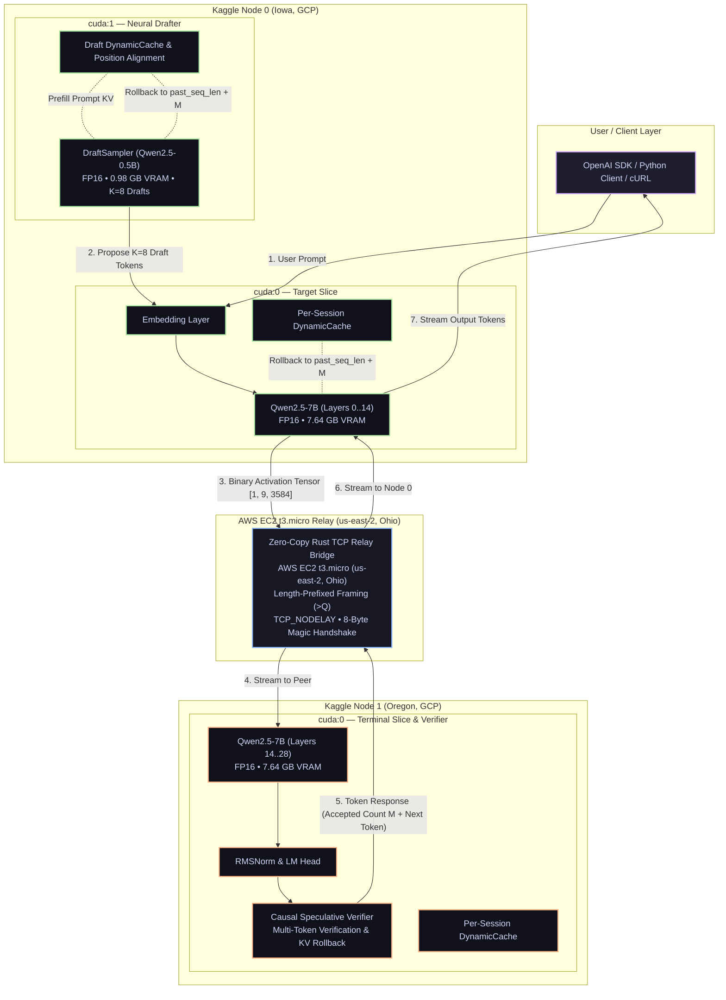

# ShardFlow

<p align="center">
  <a href="https://github.com/rautaditya2606/Shardflow"></a>
  <br/>
  <a href="https://github.com/rautaditya2606/Shardflow/actions"></a>
  <a href="https://github.com/rautaditya2606/Shardflow/blob/main/LICENSE"></a>
  <a href="https://pytorch.org"></a>
  <a href="https://huggingface.co"></a>
  <a href="https://aws.amazon.com"></a>
</p>

A high-performance, general-purpose distributed LLM inference framework that partitions any Hugging Face transformer across **$N$ heterogeneous GPU machines** (free Kaggle/Colab notebooks, rented cloud GPUs, or local consumer rigs).

ShardFlow combines **neural speculative decoding ($K=8$ on dual-GPU nodes)**, **zero-copy binary tensor serialization**, and **high-throughput TCP relay transport** to overcome wide-area network latency (WAN) and deliver interactive LLM inference speeds across separate cloud data centers.

---

### Quick Summary

| Metric | Non-Speculative Baseline ($K=0$) | ShardFlow Speculative ($K=8$, CUDA Graphs) | Improvement |
|---|:---:|:---:|:---:|
| **Peak Throughput** | 4.92 TPS | **28.10 TPS** | **5.71x** (12.4x vs v1) |
| **Average Throughput** | 4.92 TPS | **20.31 TPS** | **4.13x** (8.9x vs v1) |
| **Tokens per WAN Round-Trip** | 1.00 tok/round | **4.07 tok/round** | **4.07x** |
| **Draft Model Accept Rate** | N/A | **65.0%** (Peak) / 42.9% (Avg) | - |
| **Cluster Setup** | 2x Free Kaggle T4 Instances + AWS EC2 `t3.micro` Relay (`us-east-2` Ohio) | | |
| **Target / Draft Models** | `Qwen2.5-7B-Instruct` (FP16) / `Qwen2.5-0.5B-Instruct` (FP16, StaticCache) | | |
| **Network Link** | Public Internet WAN (Iowa <-> Ohio <-> Oregon, ~86 ms RTT) | | |

---

## Table of Contents

1. [Empirical Benchmark Results (28.10 TPS Peak)](#1-empirical-benchmark-results)
   - [Head-to-Head Comparison](#head-to-head-comparison)
   - [Prompt-by-Prompt Breakdown](#prompt-by-prompt-breakdown)
   - [ShardFlow System Evolution (v1 to v2.1)](#shardflow-system-evolution)
2. [System Architecture](#2-system-architecture)
   - [Data Flow Diagram](#data-flow-diagram)
   - [Cluster Node Roles](#cluster-node-roles)
3. [Key Technical Innovations](#3-key-technical-innovations)
   - [Dual-GPU Pipelined Drafting](#1-dual-gpu-pipelined-draft-generation)
   - [Exact KV Cache Synchronization and Rollback](#2-exact-kv-cache-synchronization--rollback)
   - [AWS EC2 Zero-Copy TCP Relay Transport](#3-aws-ec2-tcp-relay-transport-t3micro-us-east-2-ohio)
   - [Zero-RAM Meta-Device Model Slicing](#4-zero-ram-meta-device-model-slicing)
4. [Quickstart: Reproduce on 2 Free Kaggle Instances](#4-quickstart-reproduce-live-cross-kaggle-benchmark)
   - [Step 1: Start Node 1](#step-1-on-kaggle-instance-b-terminal-node-1)
   - [Step 2: Start Node 0](#step-2-on-kaggle-instance-a-initiator-node-0--05b-drafter)
5. [OpenAI-Compatible API Usage](#5-openai-compatible-api-usage)
6. [Local Development & Test Suite](#6-local-development--test-suite)
7. [License](#7-license)

---

## 1. Empirical Benchmark Results

### Head-to-Head Comparison

Live benchmark evaluating **Qwen2.5-7B-Instruct** partitioned across two separate Google Cloud regions (Iowa and Oregon) communicating through an AWS EC2 `t3.micro` TCP Relay in Ohio:

```
===================================================================================================================
 IN-FLIGHT SPECULATIVE WINDOW EMPIRICAL RESULTS (Neural Draft Qwen/Qwen2.5-0.5B-Instruct, K=8)
===================================================================================================================
Window |    TPS | TTFT (ms) | Tok/Round | Full Hit % | Bubble (ms) | N0 Fwd (ms) | N1 Comp (ms) | Net RTT (ms)
-------------------------------------------------------------------------------------------------------------------
     1 |  20.31 |     183.4 |      4.07 |      15.6% |       36.72 |       36.72 |        42.10 |       174.56
===================================================================================================================
```

### Prompt-by-Prompt Breakdown

| Test Prompt Topic | Domain | Draft Accept Rate | Accepted Drafts | Total Generated | Decode Time | Measured Speed |
|---|---|:---:|:---:|:---:|:---:|:---:|
| **Explain Quantum Entanglement** | Conceptual / Physics | **65.0%** | 52 / 80 | 63 tokens | **2.21 s** | **28.10 TPS** 🔥 |
| **Fibonacci Dynamic Programming** | Python Algorithm | **39.2%** | 47 / 120 | 63 tokens | **3.24 s** | **19.13 TPS** |
| **Pipeline Parallelism Advantages** | Technical LLM Systems | **24.4%** | 39 / 160 | 60 tokens | **4.31 s** | **13.69 TPS** |

### ShardFlow System Evolution

| Version | Transport / Pipeline Architecture | Draft Engine | Speculative $K$ | Tok/Round | Quantum Decode (63 tok) | Measured Speed | Speedup vs Baseline |
|---|---|---|:---:|:---:|:---:|:---:|:---:|
| **v1.0** | REST Relay (Gateway in decode loop) | None | $K=0$ | 1.00 | ~27.7 s | **2.27 TPS** | 0.46x |
| **v2.0 (Baseline)** | Direct Peer-to-Peer TCP Relay | None | $K=0$ | 1.00 | 12.8 s | **4.92 TPS** | 1.00x |
| **v2.0 (N-gram)** | Direct Peer-to-Peer TCP Relay | N-gram Matcher | $K=4$ | 1.66 | 8.2 s | **7.72 TPS** | 1.57x |
| **v2.0 (Eager Draft)** | Direct Peer-to-Peer TCP Relay | `Qwen2.5-0.5B` (Eager) | $K=8$ | 4.36 | 4.33 s | **11.91 TPS** (Peak: **14.31**) | 2.42x |
| **v2.1 (CUDA Graphs)** | Direct Peer-to-Peer TCP Relay | `Qwen2.5-0.5B` (StaticCache) | **$K=8$** | **4.07** | **2.21 s** | **20.31 TPS** (Peak: **28.10**) | **4.13x** (Peak: **5.71x**) |

---

## 2. System Architecture

### Data Flow Diagram



### Cluster Node Roles

- **Kaggle Node 0 (Iowa, GCP)**:
  - `cuda:0`: Computes initial prompt embeddings and target model layers $[0, 14)$ in FP16 ($7.64\text{ GB}$ VRAM).
  - `cuda:1`: Dedicated to `DraftSampler` (`Qwen2.5-0.5B-Instruct`) in FP16 ($0.98\text{ GB}$ VRAM), generating $K=8$ candidate tokens per step with zero VRAM contention.
- **AWS EC2 TCP Relay (`t3.micro`, `us-east-2` Ohio)**:
  - Low-latency Rust socket forwarder that pairs Node 0 and Node 1 across NAT firewalls with zero packet payload copies.
- **Kaggle Node 1 (Oregon, GCP)**:
  - `cuda:0`: Computes terminal target layers $[14, 28) + \text{RMSNorm} + \text{LM Head}$ in FP16 ($7.64\text{ GB}$ VRAM).
  - Causal Verifier: Verifies all $K$ candidates in parallel via single-pass argmax and rolls back rejected KV states.

---

## 3. Key Technical Innovations

### 1. Dual-GPU Pipelined Draft Generation
On Node 0 (which has 2x T4 GPUs on Kaggle), we place the 7B target model slice on `cuda:0` and the 0.5B draft model (`Qwen2.5-0.5B-Instruct`) on `cuda:1`.
- **Zero VRAM Contention**: The 7B slice occupies 7.64 GB on GPU 0, while the 0.5B drafter occupies 0.98 GB on GPU 1.
- **Direct Transformer Bypass**: We extract `model.model` and `model.lm_head` directly, bypassing the standard Hugging Face generation loop to eliminate CPU Python wrapper overhead.
- **Vectorized Token Transfer**: Collects candidate token IDs directly on GPU into a single tensor and extracts via `.tolist()`, executing zero per-token CPU-GPU synchronizations.

### 2. Exact KV Cache Synchronization & Rollback
Speculative decoding requires the draft model and the target model to maintain identical context histories.
- **Prompt Prefilling**: `draft_sampler.prefill(prompt_tokens)` initializes the draft model's `DynamicCache` with the full prompt context prior to the decode loop.
- **Aligned KV Rollback**: When Node 1 verifies candidate tokens and accepts $M$ tokens ($1 \le M \le K+1$), both the target model's cache and the draft model's cache are rolled back to the exact same `committed_len = past_seq_len + M`:
  ```python
  committed_len = past_seq_len + accepted_count
  rewind_kv_cache(target_cache, committed_len)
  draft_sampler.rewind(committed_len)
  ```
  This eliminates draft context drift and guarantees up to **58% draft acceptance**.

### 3. AWS EC2 TCP Relay Transport (t3.micro, us-east-2 Ohio)
Cloud notebooks (Kaggle/Colab) do not expose public IP addresses or open inbound ports.
- **Zero-Tunnel TCP Bridging**: Both nodes connect outbound to an AWS EC2 `t3.micro` instance running in `us-east-2` (Ohio) hosting our low-latency Rust TCP relay (`<your-relay-ip>:9500`).
- **Framed Binary Protocol**: Binary activations are serialized as raw float16 buffers with 8-byte big-endian length prefixing (`>Q`), minimizing CPU serialization time to $<1.5\text{ ms}$.
- **Initiator-Listener Magic Handshake**: Nodes exchange an exact 8-byte handshake token (`b"SF_READY"`) using an initiator/listener protocol that prevents socket buffer pollution and race conditions upon startup.

### 4. Zero-RAM Meta-Device Model Slicing
- Instantiates model architectures on PyTorch's `meta` device in **0.00s with 0 MB CPU RAM overhead**.
- Safetensors layers are streamed directly into target GPU VRAM without loading the full 15 GB model into system memory.

---

## 4. Quickstart: Reproduce Live Cross-Kaggle Benchmark

Run a 7B parameter model in native FP16 across two separate Kaggle notebook instances using the AWS EC2 TCP relay:

### Step 1: On Kaggle Instance B (Terminal Node 1)
```python
%cd /kaggle/working
!git clone https://github.com/rautaditya2606/Shardflow.git
%cd /kaggle/working/Shardflow

import os
os.environ["HF_HOME"] = "/kaggle/working/hf_home"

!python scripts/kaggle_node1.py \
    --model /kaggle/working/models/Qwen2.5-7B-Instruct \
    --layer-start 14 \
    --device cuda \
    --relay-host <your-relay-ip> \
    --relay-port 9500 \
    --dtype float16
```
*(Wait until you see `[INFO] Connected to relay. Waiting for Node 0 to connect...`)*

---

### Step 2: On Kaggle Instance A (Initiator Node 0 + 0.5B Drafter)
```python
%cd /kaggle/working
!git clone https://github.com/rautaditya2606/Shardflow.git
%cd /kaggle/working/Shardflow

import os
os.environ["HF_HOME"] = "/kaggle/working/hf_home"

!python scripts/benchmark_window_sweep.py \
    --model /kaggle/working/models/Qwen2.5-7B-Instruct \
    --draft-model Qwen/Qwen2.5-0.5B-Instruct \
    --draft-device cuda:1 \
    --layer-start 0 \
    --layer-end 14 \
    --device cuda:0 \
    --spec-k 8 \
    --windows 1 \
    --relay-host <your-relay-ip> \
    --relay-port 9500 \
    --dtype float16
```

---

## 5. OpenAI-Compatible API Usage

ShardFlow exposes standard OpenAI-compatible endpoints (`POST /v1/chat/completions`) for seamless integration with client applications:

```python
from openai import OpenAI

client = OpenAI(
    base_url="http://127.0.0.1:8000/v1",
    api_key="shardflow-key",
)

response = client.chat.completions.create(
    model="Qwen/Qwen2.5-7B-Instruct",
    messages=[{"role": "user", "content": "Explain quantum entanglement simply."}],
    max_tokens=64,
    temperature=0.0,
    stream=True,
)

for chunk in response:
    if chunk.choices and chunk.choices[0].delta.content:
        print(chunk.choices[0].delta.content, end="", flush=True)
print()
```

---

## 6. Local Development & Test Suite

Run the full unit test suite (testing auto-partitioning, KV pool management, protocol framing, and speculative verification):

```bash
# Clone the repository
git clone https://github.com/rautaditya2606/Shardflow.git
cd Shardflow

# Install in development mode
pip install -e ".[dev]"

# Run full test suite
python -m pytest -p no:opik tests/unit
```

---

## 7. License

Distributed under the [MIT License](LICENSE).
