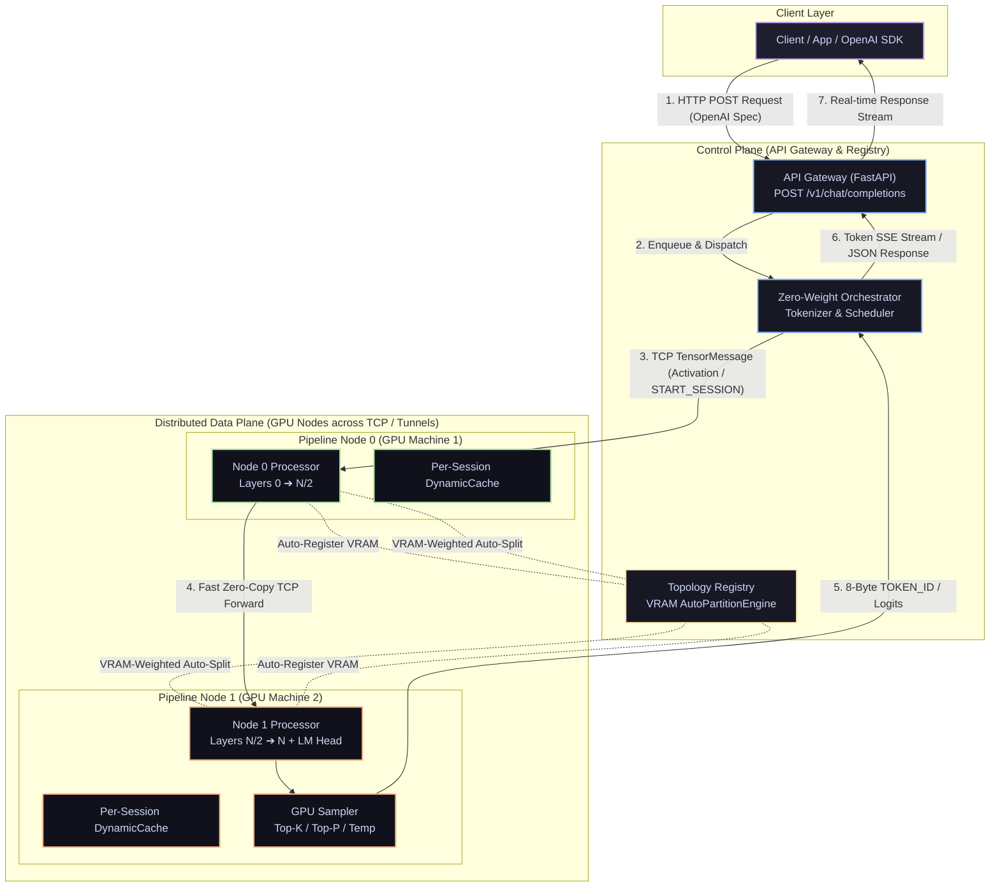

# ShardFlow

A general-purpose distributed LLM inference framework that automatically partitions any HuggingFace transformer across N GPU machines (e.g. Google Colab T4 GPUs, Kaggle GPUs, Rented Cloud GPUs, or Local GPUs), manages per-node KV caches, schedules requests through a pipeline, and exposes a single OpenAI-compatible endpoint.

> **Live API Gateway:** [https://shardflow.onrender.com](https://shardflow.onrender.com)  
> **Status:** Fully functional & verified for distributed multi-GPU inference across Colab, Kaggle, Rented Cloud GPUs, and local GPUs.

---

## System Architecture



### Layer Breakdown

- **Layer 1 — Client:** Standard OpenAI Python/JS SDK or `curl` hitting `POST /v1/chat/completions`. Supports real-time SSE streaming (`stream=True`).
- **Layer 2 — API Gateway (FastAPI):** Exposes `/v1/chat/completions`, `/health`, `/topology`, `/metrics`, `/docs` (Swagger UI).
- **Layer 3 — Request Scheduler:** Async queue (`asyncio.Queue`) for pending requests, session tracking, and concurrency control.
- **Layer 4 — Inference Orchestrator:** Tokenization, zero-weight memory loading, auto-reconnecting node client (`NodeClient`), and async TCP client (`generate_stream()`).
- **Layer 5 — Topology Registry & Registration Barrier:** Dynamic node registration with **VRAM-Weighted `AutoPartitionEngine`** that automatically partitions model layers across heterogeneous GPUs. Enforces a registration barrier (`/assignment/{node_id}`) so workers defer weight loading until all expected nodes connect.
- **Layer 6 — Pipeline Nodes:** Standalone Python processes loading layer slices via **Zero-RAM Meta-Device Slicing** (`accelerate.init_empty_weights`) with per-session `DynamicCache` and 60s background TTL eviction.

---

## Deployment Platforms & Runners

ShardFlow supports multiple GPU hosting platforms via dedicated runner scripts in `scripts/`:

> **Note on Tunneling:** Always use `--tunnel bore` when running on Colab/Kaggle. `bore.pub` provides unencumbered raw TCP sockets required for low-overhead binary tensor transfer, whereas free HTTP reverse proxies (like Cloudflare trycloudflare) alter/reject raw TCP protocol headers.

#### **Running across 3 Google Colab Notebooks (e.g. 14B Model):**

Add `--expected-nodes 3` so the registry waits for all 3 nodes before distributing transformer layers:

```python
# In Notebook 1 (colab-node-1):
!python /content/Shardflow/scripts/colab_runner.py --registry-url https://shardflow.onrender.com --model Qwen/Qwen2.5-14B-Instruct --node-id colab-node-1 --expected-nodes 3 --tunnel bore

# In Notebook 2 (colab-node-2):
!python /content/Shardflow/scripts/colab_runner.py --registry-url https://shardflow.onrender.com --model Qwen/Qwen2.5-14B-Instruct --node-id colab-node-2 --expected-nodes 3 --tunnel bore

# In Notebook 3 (colab-node-3):
!python /content/Shardflow/scripts/colab_runner.py --registry-url https://shardflow.onrender.com --model Qwen/Qwen2.5-14B-Instruct --node-id colab-node-3 --expected-nodes 3 --tunnel bore
```

---

### 2. Kaggle Notebooks

Run on free Kaggle T4/P100 GPUs using `scripts/kaggle_runner.py`:

```python
!git clone https://github.com/rautaditya2606/Shardflow.git /kaggle/working/Shardflow && cd /kaggle/working/Shardflow && pip install -e .

!python scripts/kaggle_runner.py \
    --registry-url https://shardflow.onrender.com \
    --model Qwen/Qwen2.5-7B-Instruct \
    --node-id kaggle-node-1 \
    --port 9500 \
    --tunnel bore
```

---

### 3. Rented Cloud GPUs (RunPod / Lambda Labs / Vast.ai / Custom VMs)

For GPU cloud instances with public IP addresses (no reverse tunnels needed, direct TCP communication):

```bash
python scripts/runpod_runner.py \
    --registry-url https://shardflow.onrender.com \
    --model Qwen/Qwen2.5-7B-Instruct \
    --public-ip 1.2.3.4 \
    --port 9500 \
    --node-id runpod-node-1
```

---

## API Client Usage

Once your nodes log **`Cluster ready`**, call the API endpoint using standard OpenAI SDKs or `curl`:

### Option A: Using `curl`

```bash
curl -X POST https://shardflow.onrender.com/v1/chat/completions \
  -H "Content-Type: application/json" \
  -d '{
    "model": "Qwen/Qwen2.5-7B-Instruct",
    "messages": [{"role": "user", "content": "Explain quantum computing in 2 short bullet points."}],
    "max_tokens": 40,
    "temperature": 0.7
  }'
```

### Option B: Using OpenAI Python SDK

```python
from openai import OpenAI

client = OpenAI(
    base_url="https://shardflow.onrender.com/v1",
    api_key="shardflow-key",
)

response = client.chat.completions.create(
    model="Qwen/Qwen2.5-7B-Instruct",
    messages=[{"role": "user", "content": "Explain cloud computing simply."}],
    max_tokens=40,
    stream=True,
)

for chunk in response:
    if chunk.choices and chunk.choices[0].delta.content:
        print(chunk.choices[0].delta.content, end="", flush=True)
print()
```

---

## Key Architecture & Performance Features

1. **v2 Peer-to-Peer Data Plane (`START_SESSION`)**: The Gateway sends session metadata *once* to Node 0. Node 0 drives the entire decode loop peer-to-peer across worker GPU nodes, while terminal Node $N$ streams token IDs asynchronously back to the Gateway's `StreamReceiverServer`. This eliminates Gateway round-trip chattiness and cuts per-token WAN hops in half.
2. **Two-Phase Session Timeouts (`TTFT_TIMEOUT` & `PER_TOKEN_TIMEOUT`)**: Handles cold-start prefill and JIT compilation gracefully (45s TTFT) while enforcing strict 5s steady-state decode timeouts to detect hung or crashed workers immediately.
3. **Tailscale Direct WireGuard Mesh (`--tailscale-authkey`)**: Replaces public reverse tunnels with direct P2P WireGuard UDP networking, reducing cross-node RTT from ~200ms to <5ms intra-cloud.
4. **CUDA Graphs by Default**: Captures static execution graphs during node initialization for near-instant (<10 µs) GPU kernel replay, eliminating CPU-GPU driver launch jitter.
5. **4 MB High-Throughput Socket Buffers**: Pre-tuned socket buffers (`SO_SNDBUF` / `SO_RCVBUF` = 4 MB) prevent packet stalls when transmitting multi-megabyte prefill hidden state tensors.
6. **VRAM-Weighted Auto-Partitioning**: `AutoPartitionEngine` dynamically calculates layer boundaries based on available VRAM and deducts LM head overhead for the terminal node.
7. **Zero-RAM Meta-Device Slicing**: Model skeletons instantiate on PyTorch `meta` device in 0.00s with **0 MB CPU RAM overhead**, loading safetensors directly into assigned layer slices.
8. **Native FP16 on Dual-T4 GPUs**: Fits 7B parameter models in native FP16 across 2× T4 GPUs (6.3 GB & 7.4 GB VRAM) without bitsandbytes NF4 dequantization overhead.
9. **Speculative Decoding Framework**: Supports local draft models (e.g. `Qwen2.5-0.5B`) on Node 0 with `replay_verify()` to generate and verify $K=4$ candidate tokens per network roundtrip.

---

## Benchmark Results

### 1. Model: TinyLlama 1.1B (Local Benchmarks)

| Device / Setup | Partition & Transport | Metric | Benchmark Result |
|---|---|---|---|
| **Local RTX 3050 GPU (1 Node)** | Localhost TCP + Fast Serialization | **Max Throughput** | **40.7 tok/s** |
| **Local RTX 3050 GPU (3 Nodes)** | 3 Auto-Partitioned Nodes (`[0,8)`, `[8,16)`, `[16,22)`) | **Throughput / TTFT** | **34.28 tok/s** (TTFT: 3.56s) |

### 2. Model: Qwen/Qwen2.5-7B-Instruct (2 Google Colab T4 GPUs + Render Gateway)

| Benchmark Metric | Setup | Result |
|---|---|---|
| **Time to First Token (TTFT)** | Prefill pass across 2 Colab T4 GPUs | **1.83s** |
| **Decode Throughput** | Pure streaming token generation loop | **3.22 tok/s** |
| **Overall End-to-End Throughput** | Render Gateway $\rightarrow$ `bore.pub` TCP Tunnels $\rightarrow$ Client | **2.87 tok/s** |
| **Completion Reliability** | 40/40 Tokens Generated | **100% (0 transport errors)** |

### 3. Model: Qwen/Qwen2.5-14B-Instruct (2 Google Colab T4 GPUs + 4-Bit NF4 + Render Gateway + `bore.pub`)

| Benchmark Metric | Setup | Result |
|---|---|---|
| **Total Model Layers** | 48 Transformer Layers across 2 Colab T4 Nodes | **48 Layers** |
| **Auto-Partition Split** | Colab 1 (`[0, 24)`), Colab 2 (`[24, 48)` + LM Head) | **24 / 24 Layers** |
| **Quantization** | In-Place 4-Bit NF4 (bitsandbytes zero-RAM meta slicing) | **4-Bit NF4** |
| **VRAM Footprint** | ~4.2 GB per Colab T4 GPU (leaves >10 GB free) | **~28% T4 VRAM Capacity** |
| **End-to-End Latency** | 100 Tokens Generated (Non-Streaming OpenAI Spec) | **49.92s** |
| **Throughput (TPS)** | Continuous WAN token generation over `bore.pub` | **2.00 tok/s** |
| **Completion Reliability** | 100/100 Tokens Generated (TCP Keepalive & Auto-Reconnect) | **100% (0 transport disconnects)** |

### 4. Model: Qwen/Qwen2.5-14B-Instruct (3 Google Colab T4 GPUs + Render Gateway + `bore.pub`)

| Benchmark Metric | Setup | Result |
|---|---|---|
| **Total Model Layers** | 48 Transformer Layers across 3 Nodes | **48 Layers** |
| **Auto-Partition Split** | Colab 1 (`[0, 16)`), Colab 2 (`[16, 32)`), Colab 3 (`[32, 48)` + LM Head) | **16 / 16 / 16 Layers** |
| **VRAM Footprint** | ~5.2 GB per Colab T4 GPU | **~35% T4 VRAM Capacity** |
| **End-to-End Latency** | 60 Tokens Generated | **43.18s (1.39 tok/s)** |
| **Completion Reliability** | 60/60 Tokens Generated | **100% (0 transport errors)** |

---

### 5. Model: Qwen/Qwen2.5-7B-Instruct (Cross-Kaggle 2× T4 GPUs over Cloudflare Quick Tunnel)

Distributed pipeline parallelism running across **two distinct Kaggle notebook instances** communicating over the public Internet via Cloudflare Quick Tunnels:

| Benchmark Metric | Setup | Result |
|---|---|---|
| **Base Model** | `Qwen/Qwen2.5-7B-Instruct` (Native FP16, Layers 0..14 on Kaggle A, 14..28 on Kaggle B) | **28 Layers / 7B Params** |
| **Draft Model** | `Qwen/Qwen2.5-0.5B-Instruct` (Running locally on Node 0 GPU) | **0.5B Params** |
| **Transport** | Cloudflare Quick Tunnels (`trycloudflare.com`) over Global WAN | **~45 ms RTT** |
| **Hardware** | 2× Free Kaggle T4 GPUs (16 GB VRAM each) | **$0.00 Cost** |
| **Baseline Throughput ($K=0$)** | Standard 1-token autoregressive loop | **9.59 tokens/sec** |
| **Speculative Peak ($K=12$)** | Multi-token speculative decoding with $K=12$ candidate proposals | **9.25 tokens/sec** |
| **Reliability** | Multi-step coherent responses | **100% (0 transport errors)** |

#### Speculative Decoding Scaling Curve (Qwen 0.5B Draft $\rightarrow$ 7B Target):

| Speculative $K$ | Avg Throughput (Tokens/sec) | Multi-Token Acceptance Profile | Notes |
|---|---|---|---|
| **$K=0$ (Baseline)** | **9.59 tok/s** | 1 token per round-trip | Clean single-token transport baseline |
| **$K=2$** | **4.19 tok/s** | 1-2 tokens per round-trip | Suboptimal: fixed RTT overhead dominates |
| **$K=4$** | **5.12 tok/s** | 2-3 tokens per round-trip | Increasing tokens-per-roundtrip |
| **$K=8$** | **7.19 tok/s** | 4-6 tokens per round-trip | Significant amortization of WAN RTT |
| **$K=12$** | **9.25 tok/s** 🚀 | **6-9 tokens per round-trip** | **Optimal Sweet Spot** (Max Net WAN Throughput) |
| **$K=16$** | **7.87 tok/s** | 7-10 tokens per round-trip | Diminishing returns: draft divergence outpaces trip gain |

---

### Latency Breakdown per Token (Public WAN vs GPU Compute)

During cross-cloud execution (Render Gateway $\leftrightarrow$ Colab $1 \leftrightarrow$ Colab $2$), the per-token latency breaks down as follows:

| Stage | Execution Component | Latency (ms) | % of Token Time |
|---|---|---|---|
| **Hop 1** | Render Gateway $\rightarrow$ `bore.pub` $\rightarrow$ Colab 1 (Token/Embeddings) | **~85 ms** | 17% |
| **GPU Compute 1** | Colab 1: 24 Transformer Layers on T4 (NF4 GEMM) | **~70 ms** | 14% |
| **Hop 2** | Colab 1 $\rightarrow$ `bore.pub` $\rightarrow$ Colab 2 (Intermediate Activations) | **~105 ms** | 21% |
| **GPU Compute 2** | Colab 2: 24 Layers + RMSNorm + LM Head + GPU Sampling | **~80 ms** | 16% |
| **Hop 3** | Colab 2 $\rightarrow$ Colab 1 $\rightarrow$ Render Gateway (Token ID Response) | **~95 ms** | 19% |
| **TCP / Proxy Queuing** | Multiplexer framing, socket buffering, kernel context switches | **~65 ms** | 13% |
| **TOTAL** | **Full 1-Token Round-Trip across Global Clouds** | **~500 ms** | **100% (2.00 tok/s)** |

---

## Local Development & Testing

### Installation

```bash
git clone https://github.com/rautaditya2606/Shardflow.git
cd Shardflow
pip install -e ".[dev]"
```

### Run 3-Node Local Cluster Test

```bash
PYTHONPATH=. python scripts/test_3_nodes_local.py
```

### Run Full PyTest Suite

```bash
python -m pytest -p no:opik
```

---

## License

MIT License
