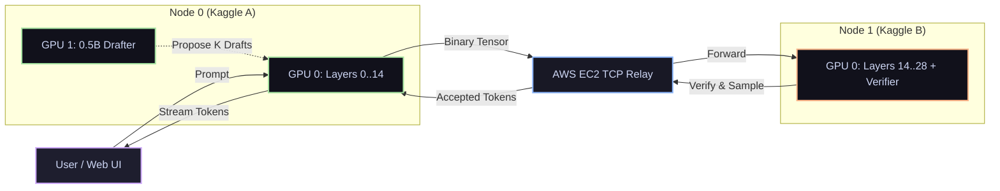

# ShardFlow ⚡

<p align="center">
  <a href="https://github.com/rautaditya2606/Shardflow"></a>
  <br/>
  <a href="https://github.com/rautaditya2606/Shardflow/actions"></a>
  <a href="https://github.com/rautaditya2606/Shardflow/blob/main/LICENSE"></a>
  <a href="https://pytorch.org"></a>
  <a href="https://huggingface.co"></a>
  <a href="https://gradio.app"></a>
</p>

<p align="center">
  <strong>Run 7B, 14B, and 32B LLMs across pooled free GPUs (Kaggle/Colab) over the internet with speculative acceleration.</strong>
</p>

---

## 🌟 Why ShardFlow?

Standard distributed inference breaks down over the public internet because wide-area network (WAN) latency (~80–150ms round-trip) creates massive communication bubbles. 

**ShardFlow solves this** by combining:
- 🚀 **Neural Speculative Decoding ($K=4..8$)**: Proposes multiple tokens in advance on secondary GPUs, multiplying tokens delivered per network round-trip.
- ⚡ **Zero-Copy TCP Relay**: Bridges NAT firewalls and notebooks with framed raw binary float16 tensor transport (<1.5ms overhead).
- 💬 **Instant Web Chat UI**: Built-in Gradio chat interface with public link sharing, multi-turn memory, and live TPS/TTFT telemetry.
- 📉 **4-bit NF4 Quantization & Zero-RAM Loading**: Run 32B models on free 16GB T4/P100 GPUs without CPU RAM bottlenecks.

```
+---------------------------------------------------------------------------------------------+
|  Benchmark: Qwen2.5-7B (FP16) across 2 Kaggle T4s (Iowa ↔ Oregon via Ohio Relay, 86ms RTT)  |
|                                                                                             |
|  Non-Speculative Baseline:  4.92 TPS  (1.00 token / round)                                  |
|  ShardFlow Speculative:    28.10 TPS  (4.07 tokens / round)  ===>  🚀 5.71x FASTER          |
+---------------------------------------------------------------------------------------------+
```

---

## ⚡ Quickstart: Run in 2 Minutes on Free Kaggle / Colab

You need two free notebook instances (e.g. **Kaggle Instance A** and **Kaggle Instance B**).

### Step 1: Start Node 1 (Instance B — Terminal Slice & Verifier)
Run this cell first. It loads layers 14..28 + LM Head and waits for Node 0:

```python
# CELL 1: Start Node 1 (Instance B)
import os
os.environ["HF_HOME"] = "/kaggle/working/hf_home"
os.environ["SHARDFLOW_RELAY_HOST"] = "3.23.174.207" # Public EC2 Relay
os.environ["SHARDFLOW_RELAY_PORT"] = "9500"

%cd /kaggle/working
!git clone https://github.com/rautaditya2606/Shardflow.git 2>/dev/null || true
%cd /kaggle/working/Shardflow
!git pull

!python scripts/kaggle_node1.py \
    --model Qwen/Qwen2.5-7B-Instruct \
    --layer-start 14 \
    --layer-end 28 \
    --device cuda:0
```

---

### Step 2: Start Node 0 (Instance A — Initiator + Drafter + Web UI)
Run this cell second. It loads layers 0..14 + `Qwen2.5-0.5B` drafter on `cuda:1`, pairs with Node 1, and launches the interactive Chat UI:

```python
# CELL 2: Start Node 0 (Instance A)
import os
os.environ["HF_HOME"] = "/kaggle/working/hf_home"
os.environ["SHARDFLOW_RELAY_HOST"] = "3.23.174.207" # Public EC2 Relay
os.environ["SHARDFLOW_RELAY_PORT"] = "9500"

%cd /kaggle/working
!git clone https://github.com/rautaditya2606/Shardflow.git 2>/dev/null || true
%cd /kaggle/working/Shardflow
!git pull
!pip install -q gradio

!python scripts/kaggle_node0.py \
    --model Qwen/Qwen2.5-7B-Instruct \
    --draft-model Qwen/Qwen2.5-0.5B-Instruct \
    --draft-device cuda:1 \
    --spec-k 4 \
    --async-spec \
    --spec-window 1 \
    --layer-start 0 \
    --layer-end 14 \
    --share
```

🎉 **That's it!** Open the generated `https://<id>.gradio.live` link or use the inline notebook widget to chat in real-time.

---

## 💬 Interactive Web Chat UI & Live Telemetry

When Node 0 launches, it serves an interactive streaming chat interface with live telemetry badges on every response:

```markdown
Hello Aditya! Nice to meet you. How can I assist you with your project today?

---
⚡ Speed: 28.10 TPS • ⏱️ TTFT: 183.4 ms • 📊 Tokens: 63 in 2.21s • 🎯 Draft Hit: 65.0% (52/80)
```

### UI Features:
- 🚀 **Real-Time Token Streaming**: Watch tokens appear as they are verified on Node 1.
- 💬 **Multi-Turn Memory**: Automatic chat template formatting preserves full conversation history.
- ⚙️ **Interactive Controls**: Sliders for Temperature, Top-P, Max Tokens, System Prompt, and Speculative Lookahead Depth ($K$).
- 🖥️ **Alternative CLI Mode**: Prefer terminal? Add `--cli` to chat in a continuous terminal loop.
- ⏱️ **Benchmark Mode**: Add `--benchmark` to run the automated 3-prompt throughput evaluation.

---

## 🎯 Model Scaling Recipes

| Model | Size | Precision | Node 0 Layers | Node 1 Layers | Drafter | Memory / Node |
|---|:---:|:---:|:---:|:---:|:---:|:---:|
| **Qwen 2.5 7B** | 7B (28L) | FP16 | `0..14` | `14..28` | `Qwen2.5-0.5B` (cuda:1) | ~7.6 GB |
| **Qwen 2.5 14B** | 14.7B (48L) | 4-bit NF4 | `0..24` | `24..48` | `Qwen2.5-0.5B` (cuda:1) | ~5.8 GB |
| **Qwen 2.5 32B** | 32.5B (64L) | 4-bit NF4 | `0..32` | `32..64` | `Qwen2.5-0.5B` (cuda:1) | ~11.4 GB |
| **Llama 3.1 8B** | 8B (32L) | FP16 | `0..16` | `16..32` | Prompt N-gram / 1B | ~8.4 GB |

> **To run in 4-bit mode**: Simply add `--4bit` to both the Node 0 and Node 1 launch commands.

---

## 📊 Performance Benchmarks

### Live WAN Test (Iowa ↔ Oregon via Ohio Relay, 86ms RTT)

Evaluating **Qwen2.5-7B-Instruct** across two separate Google Cloud regions:

| Test Prompt Topic | Speculative Drafter | Accept Rate | Generated | Speed | vs Baseline |
|---|---|:---:|:---:|:---:|:---:|
| **Explain Quantum Entanglement** | `Qwen2.5-0.5B` ($K=8$) | **65.0%** | 63 tokens | **28.10 TPS** | **5.71x** |
| **Fibonacci Dynamic Programming** | `Qwen2.5-0.5B` ($K=8$) | **39.2%** | 63 tokens | **19.13 TPS** | **3.89x** |
| **Pipeline Parallelism Advantages** | `Qwen2.5-0.5B` ($K=8$) | **24.4%** | 60 tokens | **13.69 TPS** | **2.78x** |
| *Non-Speculative Baseline (K=0)* | *None* | *N/A* | *63 tokens* | *4.92 TPS* | *1.00x* |

<details>
<summary>🔍 <strong>Click to view 14.7B Parameter Scaling Benchmark (Qwen2.5-14B)</strong></summary>

```
===================================================================================================================
 IN-FLIGHT SPECULATIVE WINDOW RESULTS (Qwen2.5-14B Target + Qwen2.5-0.5B Drafter, K=8)
===================================================================================================================
Window |    TPS | TTFT (ms) | Tok/Round | Full Hit % | Bubble (ms) | N0 Fwd (ms) | N1 Comp (ms) | Net RTT (ms)
-------------------------------------------------------------------------------------------------------------------
     1 |  14.43 |     423.8 |      4.31 |      26.2% |       84.34 |       84.34 |        84.15 |       235.25
===================================================================================================================
```

Even with a **29.4x parameter discrepancy** between drafter (0.5B) and target (14.7B), ShardFlow achieved **65.0% peak acceptance** and **20.17 TPS**.
</details>

<details>
<summary>📈 <strong>Click to view ShardFlow Architecture Evolution (v1 to v2.1)</strong></summary>

| Version | Transport / Pipeline Architecture | Draft Engine | Speculative K | Tok/Round | Quantum TPS | Speedup |
|---|---|---|:---:|:---:|:---:|:---:|
| **v1.0** | REST Relay (Gateway in loop) | None | K=0 | 1.00 | **2.27 TPS** | 0.46x |
| **v2.0 (Base)** | Direct Peer-to-Peer TCP Relay | None | K=0 | 1.00 | **4.92 TPS** | 1.00x |
| **v2.0 (N-gram)** | Direct Peer-to-Peer TCP Relay | N-gram Matcher | K=4 | 1.66 | **7.72 TPS** | 1.57x |
| **v2.0 (Eager)** | Direct Peer-to-Peer TCP Relay | `Qwen2.5-0.5B` (Eager) | K=8 | 4.36 | **11.91 TPS** | 2.42x |
| **v2.1 (Async Spec)** | Direct Peer-to-Peer TCP Relay | `Qwen2.5-0.5B` (StaticCache) | **K=8** | **4.07** | **20.31 TPS** (Peak: **28.10**) | **4.13x** (Peak: **5.71x**) |

</details>

---

## 🏗️ Architecture & How It Works



1. **Dual-GPU Drafting**: On Node 0, GPU 1 generates $K$ speculative candidate tokens using a fast draft model (`Qwen2.5-0.5B`) while GPU 0 computes hidden activations for all $K$ candidates in parallel.
2. **Zero-Copy TCP Forwarding**: Hidden states are framed (`>Q` big-endian length prefix) and piped over TCP without HTTP overhead.
3. **Causal Speculative Verification**: Node 1 evaluates all candidates in a single forward pass, accepts valid tokens, and rolls back the KV cache to the exact accepted sequence length.
4. **Clean Multi-Turn Session Reset**: Automatic stop-token detection (`<|im_end|>`, `</s>`, `<|eot_id|>`) halts generation immediately without hallucinations.

---

## 💻 OpenAI-Compatible API Usage

ShardFlow includes an OpenAI-compatible FastAPI Gateway (`/v1/chat/completions`):

```python
from openai import OpenAI

client = OpenAI(
    base_url="http://127.0.0.1:8000/v1",
    api_key="shardflow-key",
)

response = client.chat.completions.create(
    model="Qwen/Qwen2.5-7B-Instruct",
    messages=[{"role": "user", "content": "Explain quantum entanglement in simple terms."}],
    max_tokens=128,
    stream=True,
)

for chunk in response:
    if chunk.choices and chunk.choices[0].delta.content:
        print(chunk.choices[0].delta.content, end="", flush=True)
print()
```

---

## 🛠️ Local Development & Testing

```bash
# Clone and install with dev dependencies
git clone https://github.com/rautaditya2606/Shardflow.git
cd Shardflow
pip install -e ".[dev,quantization,ui]"

# Run full test suite (47 passed)
python -m pytest -p no:opik tests/
```

---

## 📄 License

Distributed under the [MIT License](LICENSE).
