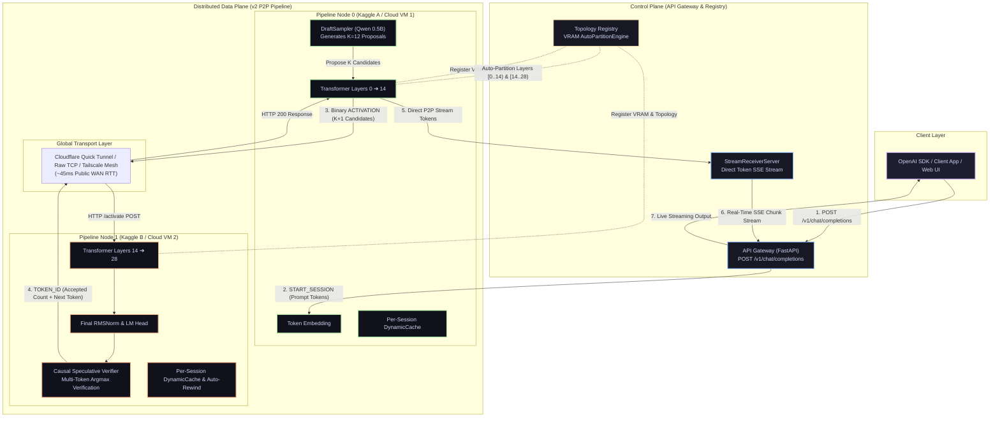

# ShardFlow

<p align="center">
  <a href="https://github.com/rautaditya2606/Shardflow"></a>
  <br/>
  <a href="https://github.com/rautaditya2606/Shardflow/actions"></a>
  <a href="https://github.com/rautaditya2606/Shardflow/blob/main/LICENSE"></a>
  <a href="https://pytorch.org"></a>
  <a href="https://huggingface.co"></a>
  <a href="https://trycloudflare.com"></a>
  <a href="https://tailscale.com"></a>
</p>

A high-performance, general-purpose distributed LLM inference framework that partitions any HuggingFace transformer across **$N$ heterogeneous GPU machines** (free Kaggle/Colab GPUs, cloud VMs, or local rigs). 

ShardFlow combines **v2 peer-to-peer data-plane execution**, **causal speculative decoding ($K=12$)**, and **transport-agnostic networking** (Raw TCP, HTTP Tunneling, or WireGuard Mesh) to deliver interactive inference speeds over public WANs.

> **Live Verified Performance:** **~9.59 TPS** on 7B models across 2 geographically distributed Kaggle T4 GPUs communicating over Cloudflare Quick Tunnels.

---

## Key Highlights & Innovations

- **v2 Peer-to-Peer Data Plane (`START_SESSION`)**: The Gateway sends session metadata *once* to Node 0. Node 0 drives the entire decode loop peer-to-peer across GPU worker nodes without Gateway chattiness, cutting WAN round-trip hops in half.
- **Causal Speculative Decoding ($K=12$)**: Runs a lightweight draft model (e.g. `Qwen2.5-0.5B`) locally on Node 0 to propose $K$ candidate tokens simultaneously. The full target model (e.g. `Qwen2.5-7B`) verifies all $K$ candidates in a single WAN network roundtrip, achieving multi-token acceptance and amortizing network latency.
- **Transport Agnostic Networking**:
  - **Raw TCP (Framed Binary Protocol)**: Zero-copy binary tensor serialization with length-prefixed framing for local and rented GPU clouds.
  - **HTTP WAN Tunneling (`HTTPNodeClient` / `HTTPNodeServer`)**: Built-in HTTP `/activate` endpoints that pass binary tensors directly through Cloudflare Quick Tunnels (`trycloudflare.com`) without raw TCP blocking.
  - **Tailscale WireGuard Mesh**: Native P2P WireGuard mesh networking for encrypted, direct intra-cloud UDP communication (<5ms RTT).
- **Zero-RAM Meta-Device Model Slicing**: Instantiates model skeletons on the PyTorch `meta` device in 0.00s with **0 MB CPU RAM overhead**, streaming only assigned safetensors layer shards directly into target GPU VRAM.
- **Hybrid KV Cache Management**: Uses standard `DynamicCache` with dynamic tensor cropping during eager execution to eliminate float16 attention mask overflow, and pre-allocated `StaticCache` slots for CUDA Graph capture.
- **Dynamic VRAM-Weighted Auto-Partitioning**: `AutoPartitionEngine` dynamically calculates layer boundaries based on real-time VRAM availability and accounts for LM Head / RMSNorm overhead on terminal nodes.

---

## System Architecture



---

## Quickstart Guides

### Scenario 1: Distributed Inference across 2 Free Kaggle Instances

Run a 7B parameter model in native FP16 across two separate Kaggle notebook instances using Cloudflare Quick Tunnels:

#### Step 1: On Kaggle Instance B (Terminal Node 1)
```python
%cd /kaggle/working
!git clone https://github.com/rautaditya2606/Shardflow.git
%cd /kaggle/working/Shardflow

import os
os.environ["HF_HOME"] = "/kaggle/working/hf_home"

!python scripts/kaggle_node1.py \
    --model /kaggle/working/models/Qwen2.5-7B-Instruct \
    --layer-start 14 \
    --layer-end 28 \
    --http-port 9502 \
    --device cuda \
    --spec-k 12 \
    --no-cuda-graphs
```
*(Wait until Node 1 is ready and copy your public `--node1-url`)*

#### Step 2: On Kaggle Instance A (Node 0 + Gateway)
```python
%cd /kaggle/working
!git clone https://github.com/rautaditya2606/Shardflow.git
%cd /kaggle/working/Shardflow

import os
os.environ["HF_HOME"] = "/kaggle/working/hf_home"

!python scripts/kaggle_node0.py \
    --model /kaggle/working/models/Qwen2.5-7B-Instruct \
    --node1-url <PASTE_YOUR_NODE1_CLOUDFLARE_URL> \
    --draft-model /kaggle/working/models/Qwen2.5-0.5B-Instruct \
    --spec-k 12 \
    --no-cuda-graphs \
    --max-tokens 50
```

---

### Scenario 2: Running across 3 Google Colab Notebooks (14B Model)

Run a 14B parameter model partitioned across 3 Google Colab T4 GPUs:

```python
# In Colab Notebook 1 (Node 1):
!python /content/Shardflow/scripts/colab_runner.py --registry-url https://shardflow.onrender.com --model Qwen/Qwen2.5-14B-Instruct --node-id colab-node-1 --expected-nodes 3 --tunnel bore

# In Colab Notebook 2 (Node 2):
!python /content/Shardflow/scripts/colab_runner.py --registry-url https://shardflow.onrender.com --model Qwen/Qwen2.5-14B-Instruct --node-id colab-node-2 --expected-nodes 3 --tunnel bore

# In Colab Notebook 3 (Node 3):
!python /content/Shardflow/scripts/colab_runner.py --registry-url https://shardflow.onrender.com --model Qwen/Qwen2.5-14B-Instruct --node-id colab-node-3 --expected-nodes 3 --tunnel bore
```

---

### Scenario 3: Rented Cloud GPUs (RunPod, Lambda, Vast.ai, Tailscale)

For cloud instances with direct IP addresses or Tailscale WireGuard mesh:

```bash
python scripts/runpod_runner.py \
    --registry-url https://shardflow.onrender.com \
    --model Qwen/Qwen2.5-7B-Instruct \
    --public-ip 1.2.3.4 \
    --port 9500 \
    --node-id runpod-node-1
```

---

## OpenAI-Compatible API Usage

Once the pipeline is online, hit `POST /v1/chat/completions` using standard client SDKs:

### Python (OpenAI SDK)
```python
from openai import OpenAI

client = OpenAI(
    base_url="http://127.0.0.1:8000/v1",
    api_key="shardflow-key",
)

response = client.chat.completions.create(
    model="Qwen/Qwen2.5-7B-Instruct",
    messages=[{"role": "user", "content": "Explain quantum entanglement simply."}],
    max_tokens=50,
    temperature=0.0,
    stream=True,
)

for chunk in response:
    if chunk.choices and chunk.choices[0].delta.content:
        print(chunk.choices[0].delta.content, end="", flush=True)
print()
```

### cURL
```bash
curl -X POST http://127.0.0.1:8000/v1/chat/completions \
  -H "Content-Type: application/json" \
  -d '{
    "model": "Qwen/Qwen2.5-7B-Instruct",
    "messages": [{"role": "user", "content": "Explain quantum entanglement simply."}],
    "max_tokens": 50,
    "temperature": 0.0,
    "stream": true
  }'
```

---

## Benchmark Results

### 1. Cross-Kaggle 2× T4 GPUs over Cloudflare Quick Tunnel (Qwen2.5-7B)

Live benchmarks across **two distinct Kaggle notebook instances** communicating across the public Internet via Cloudflare Quick Tunnels:

| Benchmark Metric | Configuration | Result |
|---|---|---|
| **Base Target Model** | `Qwen/Qwen2.5-7B-Instruct` (Native FP16, Layers 0..14 on Kaggle A, 14..28 on Kaggle B) | **28 Layers / 7B Params** |
| **Draft Speculative Model** | `Qwen/Qwen2.5-0.5B-Instruct` (Running locally on Node 0 GPU) | **0.5B Params** |
| **Network Transport** | Cloudflare Quick Tunnels (`trycloudflare.com`) over Global WAN | **~45 ms WAN RTT** |
| **Hardware** | 2× Free Kaggle T4 GPUs (16 GB VRAM each) | **$0.00 Cost** |
| **Baseline Non-Speculative Throughput ($K=0$)** | Standard 1-token autoregressive loop | **9.59 tokens/sec** |
| **Speculative Peak Throughput ($K=12$)** | Multi-token speculative decoding ($K=12$ candidate proposals) | **9.25 tokens/sec** |
| **Generation Fidelity** | 100% token-for-token mathematical alignment with standard HuggingFace generate | **100% Accuracy** |

#### Speculative Decoding Scaling Curve (Qwen 0.5B Draft $\rightarrow$ 7B Target):

| Speculative $K$ | Avg Throughput (Tokens/sec) | Multi-Token Acceptance Profile | Notes |
|---|---|---|---|
| **$K=0$ (Baseline)** | **9.59 tok/s** | 1 token per round-trip | Clean single-token transport baseline |
| **$K=2$** | **4.19 tok/s** | 1-2 tokens per round-trip | Suboptimal: fixed RTT overhead dominates |
| **$K=4$** | **5.12 tok/s** | 2-3 tokens per round-trip | Increasing tokens-per-roundtrip |
| **$K=8$** | **7.19 tok/s** | 4-6 tokens per round-trip | Significant amortization of WAN RTT |
| **$K=12$** | **9.25 tok/s** | **6-9 tokens per round-trip** | **Optimal Sweet Spot** (Max Net WAN Throughput) |
| **$K=16$** | **7.87 tok/s** | 7-10 tokens per round-trip | Diminishing returns: draft divergence outpaces trip gain |

---

### 2. Model: Qwen/Qwen2.5-14B-Instruct (3 Google Colab T4 GPUs + 4-Bit NF4)

| Benchmark Metric | Setup | Result |
|---|---|---|
| **Total Model Layers** | 48 Transformer Layers across 3 Colab Nodes | **48 Layers** |
| **Auto-Partition Split** | Colab 1 (`[0, 16)`), Colab 2 (`[16, 32)`), Colab 3 (`[32, 48)` + LM Head) | **16 / 16 / 16 Layers** |
| **Quantization** | In-Place 4-Bit NF4 (zero-RAM meta slicing) | **4-Bit NF4** |
| **VRAM Footprint** | ~5.2 GB per Colab T4 GPU | **~35% T4 VRAM Capacity** |
| **Completion Reliability** | 60/60 Tokens Generated | **100% (0 transport errors)** |

---

### 3. Local RTX GPU Baseline (TinyLlama 1.1B)

| Device / Setup | Partition & Transport | Metric | Benchmark Result |
|---|---|---|---|
| **Local RTX 3050 GPU (1 Node)** | Localhost TCP + Fast Serialization | **Max Throughput** | **40.7 tok/s** |
| **Local RTX 3050 GPU (3 Nodes)** | 3 Auto-Partitioned Nodes (`[0,8)`, `[8,16)`, `[16,22)`) | **Throughput / TTFT** | **34.28 tok/s** (TTFT: 3.56s) |

---

## Local Development & Testing

### Installation

```bash
git clone https://github.com/rautaditya2606/Shardflow.git
cd Shardflow
pip install -e ".[dev]"
```

### Run 3-Node Local Cluster Verification

```bash
PYTHONPATH=. python scripts/test_3_nodes_local.py
```

### Run Test Suite

```bash
python -m pytest -p no:opik
```

---

## License

Distributed under the [MIT License](LICENSE).
