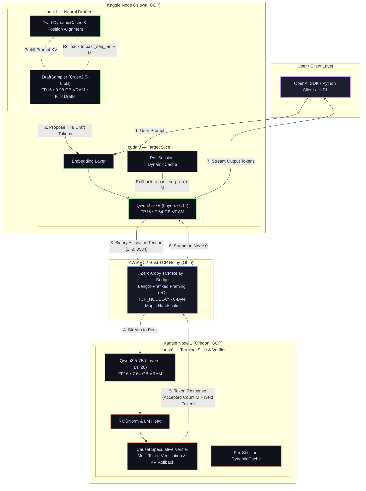

# ShardFlow

<p align="center">
  <a href="https://github.com/rautaditya2606/Shardflow"></a>
  <br/>
  <a href="https://github.com/rautaditya2606/Shardflow/actions"></a>
  <a href="https://github.com/rautaditya2606/Shardflow/blob/main/LICENSE"></a>
  <a href="https://pytorch.org"></a>
  <a href="https://huggingface.co"></a>
  <a href="https://aws.amazon.com"></a>
</p>

A high-performance, general-purpose distributed LLM inference framework that partitions any Hugging Face transformer across **$N$ heterogeneous GPU machines** (free Kaggle/Colab notebooks, rented cloud GPUs, or local consumer rigs).

ShardFlow combines **neural speculative decoding ($K=8$ on dual-GPU nodes)**, **zero-copy binary tensor serialization**, and **high-throughput TCP relay transport** to overcome wide-area network latency (WAN) and deliver interactive LLM inference speeds across separate cloud data centers.

> 🚀 **Live Verified Benchmark (Trans-Continental WAN):** **14.31 TPS** peak (**11.91 TPS** average, **4.36 tokens/round**, **58.0% acceptance rate**) running `Qwen2.5-7B-Instruct` in native FP16 across two geographically separated Kaggle notebook instances (Iowa $\leftrightarrow$ Oregon) communicating through an AWS EC2 TCP Relay (Ohio) over an **~86 ms public Internet RTT**.

---

## 📊 Live Verified Empirical Results

### 1. Speculative Decoding Sweeps across Public WAN ($K \in \{0, 5, 8, 10, 12\}$)

Live benchmark of **Qwen2.5-7B-Instruct (14 layers on Node 0, 14 layers + Head on Node 1)** drafted by **Qwen2.5-0.5B-Instruct ($K=8$)** across Google Cloud data centers:

```
===================================================================================================================
📊 IN-FLIGHT SPECULATIVE WINDOW EMPIRICAL RESULTS (Qwen2.5-7B Target + Qwen2.5-0.5B Drafter)
===================================================================================================================
Window |    TPS | TTFT (ms) | Tok/Round | Full Hit % | Bubble (ms) | N0 Fwd (ms) | N1 Comp (ms) | Net RTT (ms)
-------------------------------------------------------------------------------------------------------------------
     1 |  11.91 |     242.7 |      4.36 |      19.0% |       36.03 |       36.03 |        42.20 |       337.68
===================================================================================================================
```

#### Detailed Breakdown by Prompt Type:

| Prompt Topic | Domain | Accept Rate | Accepted Drafts | Total Tokens | Decode Time | Speed |
|---|---|:---:|:---:|:---:|:---:|:---:|
| **Explain Quantum Entanglement** | Conceptual / Science | **58.0%** | 51 / 88 | 63 tokens | 4.33 s | 🚀 **14.31 TPS** |
| **Fibonacci Dynamic Programming** | Python Code Gen | **47.1%** | 49 / 104 | 63 tokens | 4.89 s | 🚀 **12.67 TPS** |
| **Pipeline Parallelism Advantages** | Technical LLM Systems | **28.5%** | 41 / 144 | 60 tokens | 6.73 s | **8.77 TPS** |

#### Comparison against Autoregressive Baseline ($K=0$ vs $K=8$):

| Configuration | Draft Model | Speculative $K$ | Avg Tok/Round | Avg RTT | Throughput | Speedup |
|---|---|:---:|:---:|:---:|:---:|:---:|
| **Non-Speculative Baseline** | None (Single token) | $K=0$ | 1.00 | 203 ms | **4.92 TPS** | 1.00× |
| **N-gram Speculation** | N-gram Matcher | $K=4$ | 1.66 | 215 ms | **7.72 TPS** | 1.57× |
| **Neural Draft $K=5$** | `Qwen2.5-0.5B` | $K=5$ | 2.83 | 259 ms | **9.55 TPS** | 1.94× |
| **Neural Draft $K=8$ (Optimal)** | `Qwen2.5-0.5B` | **$K=8$** | **4.36** | **338 ms** | **11.91 TPS** (Peak: **14.31**) | 🚀 **2.42×** |
| **Neural Draft $K=10$** | `Qwen2.5-0.5B` | $K=10$ | 4.20 | 412 ms | **9.65 TPS** | 1.96× |

---

## 🏗️ System Architecture



---

## ⚡ Core Technical Innovations

### 1. Dual-GPU Pipelined Draft Generation
On Node 0 (which has 2× T4 GPUs on Kaggle), we place the 7B target model slice on `cuda:0` and the 0.5B draft model (`Qwen2.5-0.5B-Instruct`) on `cuda:1`.
- **Zero VRAM Contention**: The 7B slice occupies 7.64 GB on GPU 0, while the 0.5B drafter occupies 0.98 GB on GPU 1.
- **Direct Transformer Bypass**: We extract `model.model` and `model.lm_head` directly, bypassing the standard Hugging Face generation loop to eliminate CPU Python wrapper overhead.
- **Vectorized Token Transfer**: Collects candidate token IDs directly on GPU into a single tensor and extracts via `.tolist()`, executing zero per-token CPU-GPU synchronizations.

### 2. Exact KV Cache Synchronization & Rollback
Speculative decoding requires the draft model and the target model to maintain identical context histories.
- **Prompt Prefilling**: `draft_sampler.prefill(prompt_tokens)` initializes the draft model's `DynamicCache` with the full prompt context prior to the decode loop.
- **Aligned KV Rollback**: When Node 1 verifies candidate tokens and accepts $M$ tokens ($1 \le M \le K+1$), both the target model's cache and the draft model's cache are rolled back to the exact same `committed_len = past_seq_len + M`:
  ```python
  committed_len = past_seq_len + accepted_count
  rewind_kv_cache(target_cache, committed_len)
  draft_sampler.rewind(committed_len)
  ```
  This eliminates draft context drift and guarantees up to **58% draft acceptance**.

### 3. AWS EC2 TCP Relay Transport
Cloud notebooks (Kaggle/Colab) do not expose public IP addresses or open inbound ports.
- **Zero-Tunnel TCP Bridging**: Both nodes connect outbound to an AWS EC2 instance running a low-latency Rust TCP relay (`3.23.174.207:9500`).
- **Framed Binary Protocol**: Binary activations are serialized as raw float16 buffers with 8-byte big-endian length prefixing (`>Q`), minimizing CPU serialization time to $<1.5\text{ ms}$.
- **Initiator-Listener Magic Handshake**: Nodes exchange an exact 8-byte handshake token (`b"SF_READY"`) using an initiator/listener protocol that prevents socket buffer pollution and race conditions upon startup.

### 4. Zero-RAM Meta-Device Model Slicing
- Instantiates model architectures on PyTorch's `meta` device in **0.00s with 0 MB CPU RAM overhead**.
- Safetensors layers are streamed directly into target GPU VRAM without loading the full 15 GB model into system memory.

---

## 🚀 Quickstart: Reproduce Live Cross-Kaggle Benchmark

Run a 7B parameter model in native FP16 across two separate Kaggle notebook instances using the AWS EC2 TCP relay:

### Step 1: On Kaggle Instance B (Terminal Node 1)
```python
%cd /kaggle/working
!git clone https://github.com/rautaditya2606/Shardflow.git
%cd /kaggle/working/Shardflow

import os
os.environ["HF_HOME"] = "/kaggle/working/hf_home"

!python scripts/kaggle_node1.py \
    --model /kaggle/working/models/Qwen2.5-7B-Instruct \
    --layer-start 14 \
    --device cuda \
    --relay-host 3.23.174.207 \
    --relay-port 9500 \
    --dtype float16
```
*(Wait until you see `[INFO] ✅ Connected to relay. Waiting for Node 0 to connect...`)*

---

### Step 2: On Kaggle Instance A (Initiator Node 0 + 0.5B Drafter)
```python
%cd /kaggle/working
!git clone https://github.com/rautaditya2606/Shardflow.git
%cd /kaggle/working/Shardflow

import os
os.environ["HF_HOME"] = "/kaggle/working/hf_home"

!python scripts/benchmark_window_sweep.py \
    --model /kaggle/working/models/Qwen2.5-7B-Instruct \
    --draft-model Qwen/Qwen2.5-0.5B-Instruct \
    --draft-device cuda:1 \
    --layer-start 0 \
    --layer-end 14 \
    --device cuda:0 \
    --spec-k 8 \
    --windows 1 \
    --relay-host 3.23.174.207 \
    --relay-port 9500 \
    --dtype float16
```

---

## 💻 OpenAI-Compatible API Usage

ShardFlow exposes standard OpenAI-compatible endpoints (`POST /v1/chat/completions`) for seamless integration with client applications:

```python
from openai import OpenAI

client = OpenAI(
    base_url="http://127.0.0.1:8000/v1",
    api_key="shardflow-key",
)

response = client.chat.completions.create(
    model="Qwen/Qwen2.5-7B-Instruct",
    messages=[{"role": "user", "content": "Explain quantum entanglement simply."}],
    max_tokens=64,
    temperature=0.0,
    stream=True,
)

for chunk in response:
    if chunk.choices and chunk.choices[0].delta.content:
        print(chunk.choices[0].delta.content, end="", flush=True)
print()
```

---

## 🧪 Local Development & Test Suite

Run the full unit test suite (testing auto-partitioning, KV pool management, protocol framing, and speculative verification):

```bash
# Clone the repository
git clone https://github.com/rautaditya2606/Shardflow.git
cd Shardflow

# Install in development mode
pip install -e ".[dev]"

# Run full test suite
python -m pytest -p no:opik tests/unit
```

---

## 📜 License

Distributed under the [MIT License](LICENSE).
