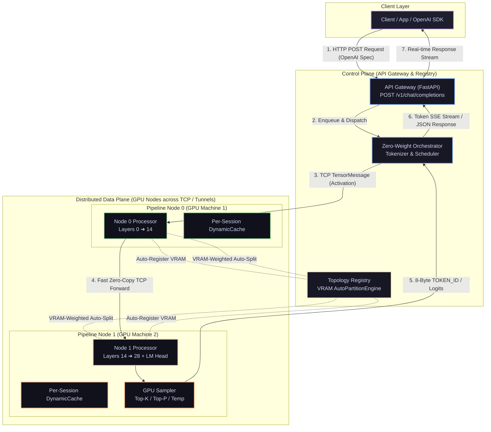

# ShardFlow

A general-purpose distributed LLM inference framework that automatically partitions any HuggingFace transformer across N GPU machines (e.g. Google Colab T4 GPUs, local GPUs, or cloud instances), manages per-node KV caches, schedules concurrent requests through a micro-batch pipeline, and exposes a single OpenAI-compatible endpoint.

> **Live API Gateway:** [https://shardflow.onrender.com](https://shardflow.onrender.com)  
> **Status:** Fully functional & verified for distributed multi-GPU inference across Google Colab accounts and local GPUs.

---

## System Architecture



### Layer Breakdown

- **Layer 1 — Client:** Standard OpenAI SDK or `curl` hitting `POST /v1/chat/completions`. Supports real-time SSE streaming (`stream=True`).
- **Layer 2 — API Gateway (FastAPI):** Exposes `/v1/chat/completions`, `/health`, `/metrics`, `/docs` (Swagger UI).
- **Layer 3 — Request Scheduler:** Async queue (`asyncio.Queue`) for pending requests, session tracking, concurrency control.
- **Layer 4 — Inference Orchestrator:** Tokenization, zero-weight memory loading, GPU sampling handler, and async TCP client (`generate_stream()`).
- **Layer 5 — Topology Registry & Auto-Partition:** Dynamic node registration with **VRAM-Weighted `AutoPartitionEngine`** that automatically partitions model layers across heterogeneous GPUs without manual bounds.
- **Layer 6 — Pipeline Nodes:** Standalone Python processes loading layer slices via **Zero-RAM Meta-Device Slicing** (`accelerate.init_empty_weights`) with per-session `DynamicCache` and 60s background TTL eviction.

---

## 🚀 Running on Google Colab (2 T4 GPUs)

Run an **8 Billion parameter model** (e.g. `Qwen/Qwen2.5-7B-Instruct`) split across two free Google Colab accounts.

### Step 1: Start Colab Tab 2 (Account 2 - Incognito Tab)
Run this in **Colab Tab 2** (registers as Node 1; bounds auto-assigned by registry):

```python
%cd /content
!rm -rf /content/Shardflow
!git clone https://github.com/rautaditya2606/Shardflow.git /content/Shardflow
%cd /content/Shardflow
!pip install -q -e .

!python scripts/colab_runner.py \
  --registry-url https://shardflow.onrender.com \
  --model Qwen/Qwen2.5-7B-Instruct \
  --node-id colab-node-1 \
  --port 9501
```
*Wait until it logs: `Node ready — layers [14, 28), LAST node (has LM head)`*

---

### Step 2: Start Colab Tab 1 (Account 1 - Normal Tab)
Run this in **Colab Tab 1** (registers as Node 0; bounds auto-assigned by registry):

```python
%cd /content
!rm -rf /content/Shardflow
!git clone https://github.com/rautaditya2606/Shardflow.git /content/Shardflow
%cd /content/Shardflow
!pip install -q -e .

!python scripts/colab_runner.py \
  --registry-url https://shardflow.onrender.com \
  --model Qwen/Qwen2.5-7B-Instruct \
  --node-id colab-node-0 \
  --port 9500
```
*Wait until it logs: `Node ready — layers [0, 14), INTERMEDIATE node`*

---

### Step 3: Call the OpenAI Endpoint

#### Option A: Using `curl`
```bash
curl https://shardflow.onrender.com/v1/chat/completions \
  -H "Content-Type: application/json" \
  -d '{
    "model": "Qwen/Qwen2.5-7B-Instruct",
    "messages": [{"role": "user", "content": "Explain artificial intelligence in one simple sentence."}],
    "max_tokens": 40
  }'
```

#### Option B: Using OpenAI Python SDK
```python
from openai import OpenAI

client = OpenAI(
    base_url="https://shardflow.onrender.com/v1",
    api_key="not-needed",
)

response = client.chat.completions.create(
    model="Qwen/Qwen2.5-7B-Instruct",
    messages=[{"role": "user", "content": "Explain cloud computing simply."}],
    max_tokens=40,
)

print(response.choices[0].message.content)
```

---

## Key Performance Optimizations

1. **VRAM-Weighted Auto-Partitioning**: Nodes register VRAM capacity, and `AutoPartitionEngine` dynamically allocates layer slices across heterogeneous GPUs without manual bounds.
2. **Zero-RAM Meta-Device Loading**: Model skeletons are instantiated on PyTorch `meta` device in 0.00s with **0 MB CPU RAM overhead**, loading weights directly into assigned slices to prevent CPU RAM OOMs on 14B/32B/70B models.
3. **Fast Tensor Serialization**: Replaced slow PyTorch element-wise storage serialization with fast C-level numpy view reinterpret (`tensor.view(torch.uint8).cpu().numpy().tobytes()`), reducing tensor serialization overhead to **0.005ms (2000x faster)**.
4. **GPU-Side Token Sampling**: Last node samples next token directly on GPU logits and returns an **8-byte `TOKEN_ID`** message, reducing back-propagation payload from 64 KB to 8 bytes.
5. **High-Watermark Draining & Zero-Copy**: Memoryviews (`torch.frombuffer`), high-watermark socket draining, and `socket.TCP_NODELAY` socket options for sub-millisecond network framing.
6. **Heartbeat Auto-Reregistration**: Nodes automatically re-register with the registry if the server process restarts.

---

## Local Development & Testing

### Installation

```bash
git clone https://github.com/rautaditya2606/Shardflow.git
cd Shardflow
pip install -e ".[dev]"
```

### Run Local E2E Pipeline Test

```bash
PYTHONPATH=. python scripts/test_local_real_server.py
```

---

## Benchmark Results

### 1. Model: TinyLlama 1.1B

| Device / Setup | Partition & Transport | Metric | Benchmark Result |
|---|---|---|---|
| **Local RTX 3050 GPU (1 Node)** | Localhost TCP + Fast Serialization | **Max Throughput** | **40.7 tok/s** |
| **Local RTX 3050 GPU (3 Nodes)** | 3 Auto-Partitioned Nodes (`[0,8)`, `[8,16)`, `[16,22)`) | **Throughput / TTFT** | **34.28 tok/s** (TTFT: 3.56s) |

### 2. Model: Qwen/Qwen2.5-7B-Instruct (2 Google Colab T4 GPUs + Render Gateway)

| Benchmark Metric | Setup | Result |
|---|---|---|
| **Time to First Token (TTFT)** | Prefill pass across 2 Colab T4 GPUs | **1.83s** |
| **Decode Throughput** | Pure streaming token generation loop | **3.22 tok/s** |
| **Overall End-to-End Throughput** | Render Gateway $\rightarrow$ `bore.pub` TCP Tunnels $\rightarrow$ Client | **2.87 tok/s** |
| **Completion Reliability** | 40/40 Tokens Generated | **100% (0 transport errors)** |

### 3. Model: Qwen/Qwen2.5-14B-Instruct (2 Google Colab T4 GPUs + Render Gateway)

| Benchmark Metric | Setup | Result |
|---|---|---|
| **Total Model Layers** | 48 Transformer Layers | **48 Layers** |
| **Auto-Partition Split** | Colab 1 (`[0, 25)`), Colab 2 (`[25, 48)` + LM Head) | **25 / 23 Layers** |
| **VRAM Footprint** | ~7.2 GB per Colab T4 GPU | **~50% T4 VRAM Capacity** |
| **End-to-End Latency** | 40 Tokens Generated | **17.65s (2.27 tok/s)** |
| **Completion Reliability** | 40/40 Tokens Generated | **100% (0 transport errors)** |

