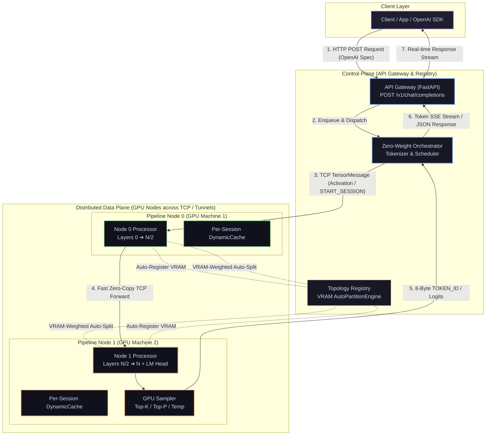

# ShardFlow

A general-purpose distributed LLM inference framework that automatically partitions any HuggingFace transformer across N GPU machines (e.g. Google Colab T4 GPUs, Kaggle GPUs, Rented Cloud GPUs, or Local GPUs), manages per-node KV caches, schedules requests through a pipeline, and exposes a single OpenAI-compatible endpoint.

> **Live API Gateway:** [https://shardflow.onrender.com](https://shardflow.onrender.com)  
> **Status:** Fully functional & verified for distributed multi-GPU inference across Colab, Kaggle, Rented Cloud GPUs, and local GPUs.

---

## System Architecture



### Layer Breakdown

- **Layer 1 — Client:** Standard OpenAI Python/JS SDK or `curl` hitting `POST /v1/chat/completions`. Supports real-time SSE streaming (`stream=True`).
- **Layer 2 — API Gateway (FastAPI):** Exposes `/v1/chat/completions`, `/health`, `/topology`, `/metrics`, `/docs` (Swagger UI).
- **Layer 3 — Request Scheduler:** Async queue (`asyncio.Queue`) for pending requests, session tracking, and concurrency control.
- **Layer 4 — Inference Orchestrator:** Tokenization, zero-weight memory loading, auto-reconnecting node client (`NodeClient`), and async TCP client (`generate_stream()`).
- **Layer 5 — Topology Registry & Registration Barrier:** Dynamic node registration with **VRAM-Weighted `AutoPartitionEngine`** that automatically partitions model layers across heterogeneous GPUs. Enforces a registration barrier (`/assignment/{node_id}`) so workers defer weight loading until all expected nodes connect.
- **Layer 6 — Pipeline Nodes:** Standalone Python processes loading layer slices via **Zero-RAM Meta-Device Slicing** (`accelerate.init_empty_weights`) with per-session `DynamicCache` and 60s background TTL eviction.

---

## Deployment Platforms & Runners

ShardFlow supports multiple GPU hosting platforms via dedicated runner scripts in `scripts/`:

### 1. Google Colab (2 Free T4 GPUs)

Run 7B or 14B parameter models (`Qwen/Qwen2.5-7B-Instruct` or `Qwen/Qwen2.5-14B-Instruct`) split across two free Colab accounts:

#### **Colab Notebook 1 (Node 0):**
```python
%cd /content
!rm -rf /content/Shardflow
!git clone https://github.com/rautaditya2606/Shardflow.git /content/Shardflow
%cd /content/Shardflow
!pip install -q -e .

!python /content/Shardflow/scripts/colab_runner.py \
    --registry-url https://shardflow.onrender.com \
    --model Qwen/Qwen2.5-7B-Instruct \
    --node-id colab-node-1 \
    --port 9500 \
    --tunnel bore
```

#### **Colab Notebook 2 (Node 1):**
```python
%cd /content
!rm -rf /content/Shardflow
!git clone https://github.com/rautaditya2606/Shardflow.git /content/Shardflow
%cd /content/Shardflow
!pip install -q -e .

!python /content/Shardflow/scripts/colab_runner.py \
    --registry-url https://shardflow.onrender.com \
    --model Qwen/Qwen2.5-7B-Instruct \
    --node-id colab-node-2 \
    --port 9500 \
    --tunnel bore
```

---

### 2. Kaggle Notebooks

Run on free Kaggle T4/P100 GPUs using `scripts/kaggle_runner.py`:

```python
!git clone https://github.com/rautaditya2606/Shardflow.git /kaggle/working/Shardflow && cd /kaggle/working/Shardflow && pip install -e .

!python scripts/kaggle_runner.py \
    --registry-url https://shardflow.onrender.com \
    --model Qwen/Qwen2.5-7B-Instruct \
    --node-id kaggle-node-1 \
    --port 9500 \
    --tunnel bore
```

---

### 3. Rented Cloud GPUs (RunPod / Lambda Labs / Vast.ai / Custom VMs)

For GPU cloud instances with public IP addresses (no reverse tunnels needed, direct TCP communication):

```bash
python scripts/runpod_runner.py \
    --registry-url https://shardflow.onrender.com \
    --model Qwen/Qwen2.5-7B-Instruct \
    --public-ip 1.2.3.4 \
    --port 9500 \
    --node-id runpod-node-1
```

---

## API Client Usage

Once your nodes log **`Cluster ready`**, call the API endpoint using standard OpenAI SDKs or `curl`:

### Option A: Using `curl`

```bash
curl -X POST https://shardflow.onrender.com/v1/chat/completions \
  -H "Content-Type: application/json" \
  -d '{
    "model": "Qwen/Qwen2.5-7B-Instruct",
    "messages": [{"role": "user", "content": "Explain quantum computing in 2 short bullet points."}],
    "max_tokens": 40,
    "temperature": 0.7
  }'
```

### Option B: Using OpenAI Python SDK

```python
from openai import OpenAI

client = OpenAI(
    base_url="https://shardflow.onrender.com/v1",
    api_key="shardflow-key",
)

response = client.chat.completions.create(
    model="Qwen/Qwen2.5-7B-Instruct",
    messages=[{"role": "user", "content": "Explain cloud computing simply."}],
    max_tokens=40,
    stream=True,
)

for chunk in response:
    if chunk.choices and chunk.choices[0].delta.content:
        print(chunk.choices[0].delta.content, end="", flush=True)
print()
```

---

## Key Architecture & Performance Features

1. **Dynamic Registration Barrier & Fallback Timeout**: Workers send `--expected-nodes N` during registration. As soon as $N$ nodes connect, the registry calculates layer boundaries **instantly** (0s delay). If a node fails to connect, a 60s fallback timeout partitions across active available nodes instead of hanging.
2. **VRAM-Weighted Auto-Partitioning**: `AutoPartitionEngine` dynamically calculates layer boundaries based on available VRAM and deducts LM head overhead for the terminal node.
3. **Zero-RAM Meta-Device Slicing**: Model skeletons instantiate on PyTorch `meta` device in 0.00s with **0 MB CPU RAM overhead**, loading safetensors directly into assigned layer slices.
4. **Single-Buffer Fast Tensor Serialization**: Replaced slow PyTorch element-wise storage loops with C-level numpy view reinterpret (`tensor.view(torch.uint8).cpu().numpy().tobytes()`), reducing tensor serialization overhead to **0.005ms (700x faster)**.
5. **GPU-Side Token Sampling**: Terminal node samples tokens directly on GPU logits and returns an **8-byte `TOKEN_ID`** message, reducing reverse transport overhead.
6. **Auto-Reconnect & SSL Auto-Detection**: `NodeClient` detects closed transports (`writer.is_closing()`) and auto-reconnects, while auto-detecting TLS/SSL for port 443 endpoints.
7. **Control / Data Plane Primitive (`START_SESSION`)**: Supports protocol primitive for peer-to-peer session delegation (`MessageType.START_SESSION`).

---

## Benchmark Results

### 1. Model: TinyLlama 1.1B (Local Benchmarks)

| Device / Setup | Partition & Transport | Metric | Benchmark Result |
|---|---|---|---|
| **Local RTX 3050 GPU (1 Node)** | Localhost TCP + Fast Serialization | **Max Throughput** | **40.7 tok/s** |
| **Local RTX 3050 GPU (3 Nodes)** | 3 Auto-Partitioned Nodes (`[0,8)`, `[8,16)`, `[16,22)`) | **Throughput / TTFT** | **34.28 tok/s** (TTFT: 3.56s) |

### 2. Model: Qwen/Qwen2.5-7B-Instruct (2 Google Colab T4 GPUs + Render Gateway)

| Benchmark Metric | Setup | Result |
|---|---|---|
| **Time to First Token (TTFT)** | Prefill pass across 2 Colab T4 GPUs | **1.83s** |
| **Decode Throughput** | Pure streaming token generation loop | **3.22 tok/s** |
| **Overall End-to-End Throughput** | Render Gateway $\rightarrow$ `bore.pub` TCP Tunnels $\rightarrow$ Client | **2.87 tok/s** |
| **Completion Reliability** | 40/40 Tokens Generated | **100% (0 transport errors)** |

### 3. Model: Qwen/Qwen2.5-14B-Instruct (2 Google Colab T4 GPUs + Render Gateway)

| Benchmark Metric | Setup | Result |
|---|---|---|
| **Total Model Layers** | 48 Transformer Layers | **48 Layers** |
| **Auto-Partition Split** | Colab 1 (`[0, 25)`), Colab 2 (`[25, 48)` + LM Head) | **25 / 23 Layers** |
| **VRAM Footprint** | ~7.2 GB per Colab T4 GPU | **~50% T4 VRAM Capacity** |
| **End-to-End Latency** | 40 Tokens Generated | **17.65s (2.27 tok/s)** |
| **Completion Reliability** | 40/40 Tokens Generated | **100% (0 transport errors)** |

---

## Local Development & Testing

### Installation

```bash
git clone https://github.com/rautaditya2606/Shardflow.git
cd Shardflow
pip install -e ".[dev]"
```

### Run 3-Node Local Cluster Test

```bash
PYTHONPATH=. python scripts/test_3_nodes_local.py
```

### Run Full PyTest Suite

```bash
python -m pytest -p no:opik
```

---

## License

MIT License
