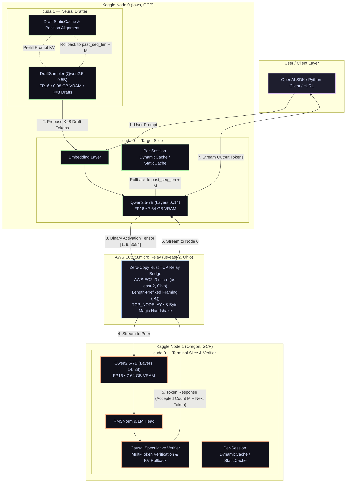

# ShardFlow

<p align="center">
  <a href="https://github.com/rautaditya2606/Shardflow"></a>
  <br/>
  <a href="https://github.com/rautaditya2606/Shardflow/actions"></a>
  <a href="https://github.com/rautaditya2606/Shardflow/blob/main/LICENSE"></a>
  <a href="https://pytorch.org"></a>
  <a href="https://huggingface.co"></a>
  <a href="https://aws.amazon.com"></a>
</p>

A high-performance, general-purpose distributed LLM inference framework that partitions any Hugging Face transformer across **N heterogeneous GPU machines** (free Kaggle/Colab notebooks, rented cloud GPUs, or local consumer rigs).

ShardFlow combines **neural speculative decoding (K=8 on dual-GPU nodes)**, **zero-copy binary tensor serialization**, and **high-throughput TCP relay transport** to overcome wide-area network latency (WAN) and deliver interactive LLM inference speeds across separate cloud data centers.

---

### Quick Summary

| Metric | Non-Speculative Baseline (K=0) | ShardFlow Speculative (K=8, CUDA Graphs) | Improvement |
|---|:---:|:---:|:---:|
| **Peak Throughput** | 4.92 TPS | **28.10 TPS** | **5.71x** (12.4x vs v1) |
| **Average Throughput** | 4.92 TPS | **20.31 TPS** | **4.13x** (8.9x vs v1) |
| **Tokens per WAN Round-Trip** | 1.00 tok/round | **4.07 tok/round** | **4.07x** |
| **Draft Model Accept Rate** | N/A | **65.0%** (Peak) / 42.9% (Avg) | - |
| **Cluster Setup** | 2x Free Kaggle T4 Instances + AWS EC2 `t3.micro` Relay (`us-east-2` Ohio) | | |
| **Target / Draft Models** | `Qwen2.5-7B-Instruct` (FP16) / `Qwen2.5-0.5B-Instruct` (FP16, StaticCache) | | |
| **Network Link** | Public Internet WAN (Iowa to Ohio to Oregon, ~86 ms RTT) | | |

---

## Table of Contents

1. [Empirical Benchmark Results (28.10 TPS Peak)](#1-empirical-benchmark-results)
   - [Head-to-Head Comparison](#head-to-head-comparison)
   - [Prompt-by-Prompt Breakdown](#prompt-by-prompt-breakdown)
   - [ShardFlow System Evolution (v1 to v2.1)](#shardflow-system-evolution)
   - [14.7B Parameter Model Scaling](#147b-parameter-model-scaling-qwen25-14b-instruct-48-layers)
2. [System Architecture](#2-system-architecture)
   - [Data Flow Diagram](#data-flow-diagram)
   - [Cluster Node Roles](#cluster-node-roles)
   - [Control Plane vs Data Plane Separation](#control-plane-vs-data-plane-separation)
3. [Key Technical Innovations](#3-key-technical-innovations)
   - [Dual-GPU Pipelined Draft Generation](#1-dual-gpu-pipelined-draft-generation)
   - [Exact KV Cache Synchronization and Rollback](#2-exact-kv-cache-synchronization--rollback)
   - [AWS EC2 Zero-Copy TCP Relay Transport](#3-aws-ec2-tcp-relay-transport-t3micro-us-east-2-ohio)
   - [Zero-RAM Meta-Device Model Slicing](#4-zero-ram-meta-device-model-slicing)
   - [Auto-Partitioning and Dynamic Topology Registry](#5-auto-partitioning-and-dynamic-topology-registry)
4. [Supported Model Architectures & Quantization](#4-supported-model-architectures--quantization)
5. [Quickstart Guides](#5-quickstart-guides)
   - [Live Cross-Kaggle Benchmark](#reproduce-live-cross-kaggle-benchmark-2x-free-t4s)
   - [Local Multi-Node Demo (Single Machine)](#run-local-multi-node-demo-single-machine)
   - [Command-Line Entrypoints](#command-line-entrypoints)
6. [OpenAI-Compatible API Usage](#6-openai-compatible-api-usage)
   - [Python Client (Streaming & Non-Streaming)](#python-client-streaming--non-streaming)
   - [cURL Examples](#curl-examples)
7. [Repository Structure](#7-repository-structure)
8. [Local Development & Test Suite](#8-local-development--test-suite)
9. [License](#9-license)

---

## 1. Empirical Benchmark Results

### Head-to-Head Comparison

Live benchmark evaluating **Qwen2.5-7B-Instruct** partitioned across two separate Google Cloud regions (Iowa and Oregon) communicating through an AWS EC2 `t3.micro` TCP Relay in Ohio:

```
===================================================================================================================
 IN-FLIGHT SPECULATIVE WINDOW EMPIRICAL RESULTS (Neural Draft Qwen/Qwen2.5-0.5B-Instruct, K=8)
===================================================================================================================
Window |    TPS | TTFT (ms) | Tok/Round | Full Hit % | Bubble (ms) | N0 Fwd (ms) | N1 Comp (ms) | Net RTT (ms)
-------------------------------------------------------------------------------------------------------------------
     1 |  20.31 |     183.4 |      4.07 |      15.6% |       36.72 |       36.72 |        42.10 |       174.56
===================================================================================================================
```

### Prompt-by-Prompt Breakdown

| Test Prompt Topic | Domain | Draft Accept Rate | Accepted Drafts | Total Generated | Decode Time | Measured Speed |
|---|---|:---:|:---:|:---:|:---:|:---:|
| **Explain Quantum Entanglement** | Conceptual / Physics | **65.0%** | 52 / 80 | 63 tokens | **2.21 s** | **28.10 TPS** |
| **Fibonacci Dynamic Programming** | Python Algorithm | **39.2%** | 47 / 120 | 63 tokens | **3.24 s** | **19.13 TPS** |
| **Pipeline Parallelism Advantages** | Technical LLM Systems | **24.4%** | 39 / 160 | 60 tokens | **4.31 s** | **13.69 TPS** |

### ShardFlow System Evolution

| Version | Transport / Pipeline Architecture | Draft Engine | Speculative K | Tok/Round | Quantum Decode (63 tok) | Measured Speed | Speedup vs Baseline |
|---|---|---|:---:|:---:|:---:|:---:|:---:|
| **v1.0** | REST Relay (Gateway in decode loop) | None | K=0 | 1.00 | ~27.7 s | **2.27 TPS** | 0.46x |
| **v2.0 (Baseline)** | Direct Peer-to-Peer TCP Relay | None | K=0 | 1.00 | 12.8 s | **4.92 TPS** | 1.00x |
| **v2.0 (N-gram)** | Direct Peer-to-Peer TCP Relay | N-gram Matcher | K=4 | 1.66 | 8.2 s | **7.72 TPS** | 1.57x |
| **v2.0 (Eager Draft)** | Direct Peer-to-Peer TCP Relay | `Qwen2.5-0.5B` (Eager) | K=8 | 4.36 | 4.33 s | **11.91 TPS** (Peak: **14.31**) | 2.42x |
| **v2.1 (CUDA Graphs)** | Direct Peer-to-Peer TCP Relay | `Qwen2.5-0.5B` (StaticCache) | **K=8** | **4.07** | **2.21 s** | **20.31 TPS** (Peak: **28.10**) | **4.13x** (Peak: **5.71x**) |

---

### 14.7B Parameter Model Scaling (`Qwen2.5-14B-Instruct`, 48 Layers)

Live cross-region benchmark of **Qwen2.5-14B-Instruct** (48 layers, 4-bit NF4 weights) partitioned across 2 Kaggle nodes communicating over WAN:

```
===================================================================================================================
 IN-FLIGHT SPECULATIVE WINDOW EMPIRICAL RESULTS (Qwen2.5-14B Target + Qwen2.5-0.5B Drafter, K=8)
===================================================================================================================
Window |    TPS | TTFT (ms) | Tok/Round | Full Hit % | Bubble (ms) | N0 Fwd (ms) | N1 Comp (ms) | Net RTT (ms)
-------------------------------------------------------------------------------------------------------------------
     1 |  14.43 |     423.8 |      4.31 |      26.2% |       84.34 |       84.34 |        84.15 |       235.25
===================================================================================================================
```

| Test Prompt Topic | Target Model | Draft Model | Draft Accept Rate | Total Generated | Decode Time | Measured Speed |
|---|---|---|:---:|:---:|:---:|:---:|
| **Fibonacci Dynamic Programming** | `Qwen2.5-14B` (48L) | `Qwen2.5-0.5B` (K=8) | **65.0%** | 63 tokens | **3.07 s** | **20.17 TPS** |
| **Explain Quantum Entanglement** | `Qwen2.5-14B` (48L) | `Qwen2.5-0.5B` (K=8) | **41.1%** | 61 tokens | **4.82 s** | **12.45 TPS** |
| **Pipeline Parallelism Advantages** | `Qwen2.5-14B` (48L) | `Qwen2.5-0.5B` (K=8) | **28.5%** | 60 tokens | **5.53 s** | **10.67 TPS** |

> [!NOTE]
> Even with a **29.4x parameter scale discrepancy** (0.5B drafter predicting for a 14.7B target), ShardFlow achieved **65.0% acceptance** and **20.17 TPS peak** over public internet WAN links on free cloud GPUs.

---

## 2. System Architecture

### Data Flow Diagram



### Cluster Node Roles

- **Kaggle Node 0 (Iowa, GCP)**:
  - `cuda:0`: Computes initial prompt embeddings and target model layers [0, 14) in FP16 (7.64 GB VRAM).
  - `cuda:1`: Dedicated to `DraftSampler` (`Qwen2.5-0.5B-Instruct`) in FP16 (0.98 GB VRAM), generating K=8 candidate tokens per step with zero VRAM contention.
- **AWS EC2 TCP Relay (`t3.micro`, `us-east-2` Ohio)**:
  - Low-latency socket forwarder that pairs Node 0 and Node 1 across NAT firewalls with zero packet payload copies.
- **Kaggle Node 1 (Oregon, GCP)**:
  - `cuda:0`: Computes terminal target layers [14, 28) + RMSNorm + LM Head in FP16 (7.64 GB VRAM).
  - Causal Verifier: Verifies all K candidates in parallel via single-pass argmax and rolls back rejected KV states.

### Control Plane vs Data Plane Separation

ShardFlow separates control plane orchestration from data plane token execution:
- **Control Plane**: The Gateway and Dynamic Registry handle client sessions, request queuing, health tracking, and SSE streaming.
- **Data Plane**: Worker nodes communicate peer-to-peer over raw framed TCP sockets, ensuring the Gateway is never in the per-token latency path during generation.

---

## 3. Key Technical Innovations

### 1. Dual-GPU Pipelined Draft Generation
On Node 0 (which has 2x T4 GPUs on Kaggle), we place the 7B target model slice on `cuda:0` and the 0.5B draft model (`Qwen2.5-0.5B-Instruct`) on `cuda:1`.
- **Zero VRAM Contention**: The 7B slice occupies 7.64 GB on GPU 0, while the 0.5B drafter occupies 0.98 GB on GPU 1.
- **Direct Transformer Bypass**: We extract `model.model` and `model.lm_head` directly, bypassing the standard Hugging Face generation loop to eliminate CPU Python wrapper overhead.
- **Vectorized Token Transfer**: Collects candidate token IDs directly on GPU into a single tensor and extracts via `.tolist()`, executing zero per-token CPU-GPU synchronizations.
- **Prompt-Lookup N-Gram Drafter**: Includes a zero-parameter `NGramDraftSampler` for fast continuation extraction when running on single-GPU nodes.

### 2. Exact KV Cache Synchronization & Rollback
Speculative decoding requires the draft model and the target model to maintain identical context histories.
- **Prompt Prefilling**: `draft_sampler.prefill(prompt_tokens)` initializes the draft model's cache with the full prompt context prior to the decode loop.
- **Universal KV Rewind**: When Node 1 verifies candidate tokens and accepts M tokens ($1 \le M \le K+1$), both the target model's cache and the draft model's cache are rolled back to the exact same `committed_len = past_seq_len + M`:
  ```python
  committed_len = past_seq_len + accepted_count
  rewind_kv_cache(target_cache, committed_len)
  draft_sampler.rewind(committed_len)
  ```
- **Static Cache Support**: Safely zeroes out uncommitted key/value slots under `torch.inference_mode()` for CUDA Graph compatibility.

### 3. AWS EC2 TCP Relay Transport (t3.micro, us-east-2 Ohio)
Cloud notebooks (Kaggle/Colab) do not expose public IP addresses or open inbound ports.
- **Zero-Tunnel TCP Bridging**: Both nodes connect outbound to an AWS EC2 `t3.micro` instance running in `us-east-2` (Ohio) hosting our low-latency TCP relay (`<your-relay-ip>:9500`).
- **Framed Binary Protocol**: Binary activations are serialized as raw float16 buffers with 8-byte big-endian length prefixing (`>Q`), minimizing CPU serialization time to <1.5 ms.
- **Socket Optimizations**: Sockets are configured with `TCP_NODELAY`, `SO_KEEPALIVE`, `TCP_QUICKACK`, and 4 MB buffer allocations.
- **Initiator-Listener Magic Handshake**: Nodes exchange an exact 8-byte handshake token (`b"SF_READY"`) using an initiator/listener protocol that prevents socket buffer pollution and race conditions upon startup.

### 4. Zero-RAM Meta-Device Model Slicing
- Instantiates model architectures on PyTorch's `meta` device in 0.00s with 0 MB CPU RAM overhead.
- Safetensors layers are streamed directly into target GPU VRAM without loading the full 15 GB model into system memory.

### 5. Auto-Partitioning and Dynamic Topology Registry
- **Auto-Partition Engine**: Dynamically calculates layer distribution across heterogeneous nodes based on reported VRAM and LM head memory overhead.
- **Fast Offline Metadata**: Registry looks up layer counts and hidden dimensions from a local table without network stalls during node registration.

---

## 4. Supported Model Architectures & Quantization

ShardFlow supports any Hugging Face causal language model family:

| Model Family | Examples | Supported Precisions |
|---|---|---|
| **Qwen 2.5** | `Qwen2.5-0.5B`, `1.5B`, `3B`, `7B`, `14B`, `32B` | FP16, BF16, 4-bit NF4 |
| **DeepSeek R1 Distill** | `DeepSeek-R1-Distill-Qwen-7B`, `14B` | FP16, BF16, 4-bit NF4 |
| **LLaMA 3 / 3.1 / 3.2** | `Meta-Llama-3-8B`, `Meta-Llama-3-8B-Instruct` | FP16, BF16, 4-bit NF4 |
| **Mistral / Mixtral** | `Mistral-7B-v0.1`, `Mistral-7B-Instruct-v0.2` | FP16, BF16 |
| **Gemma 2** | `gemma-2-2b-it`, `gemma-2-9b-it` | FP16, BF16 |
| **TinyLlama** | `TinyLlama-1.1B-Chat-v1.0` | FP16, BF16, FP32 |

---

## 5. Quickstart Guides

### Reproduce Live Cross-Kaggle Benchmark (2x Free T4s)

Run a 7B parameter model in native FP16 across two separate Kaggle notebook instances using the AWS EC2 TCP relay:

#### Step 1: On Kaggle Instance B (Terminal Node 1)
```bash
# In Kaggle Notebook B
%cd /kaggle/working
!git clone https://github.com/rautaditya2606/Shardflow.git
%cd /kaggle/working/Shardflow

import os
os.environ["HF_HOME"] = "/kaggle/working/hf_home"

!python scripts/kaggle_node1.py \
    --model /kaggle/working/models/Qwen2.5-7B-Instruct \
    --layer-start 14 \
    --device cuda \
    --relay-host <your-relay-ip> \
    --relay-port 9500 \
    --dtype float16
```
*(Wait until you see `[INFO] Connected to relay. Waiting for Node 0 to connect...`)*

---

#### Step 2: On Kaggle Instance A (Initiator Node 0 + 0.5B Drafter)
```bash
# In Kaggle Notebook A
%cd /kaggle/working
!git clone https://github.com/rautaditya2606/Shardflow.git
%cd /kaggle/working/Shardflow

import os
os.environ["HF_HOME"] = "/kaggle/working/hf_home"

!python scripts/benchmark_window_sweep.py \
    --model /kaggle/working/models/Qwen2.5-7B-Instruct \
    --draft-model Qwen/Qwen2.5-0.5B-Instruct \
    --draft-device cuda:1 \
    --layer-start 0 \
    --layer-end 14 \
    --device cuda:0 \
    --spec-k 8 \
    --windows 1 \
    --relay-host <your-relay-ip> \
    --relay-port 9500 \
    --dtype float16
```

---

### Run Local Multi-Node Demo (Single Machine)

ShardFlow includes an all-in-one local demo script that spins up a 2-node distributed pipeline, attaches the OpenAI API Gateway, and generates streamed responses:

```bash
# Clone the repository
git clone https://github.com/rautaditya2606/Shardflow.git
cd Shardflow

# Install dependencies
pip install -e ".[dev]"

# Run the local 2-node pipeline demo
python run_demo.py
```

---

### Command-Line Entrypoints

ShardFlow packages standard CLI tools for standalone orchestration:

```bash
# Start Topology Registry
shardflow-registry --host 0.0.0.0 --port 8001

# Start OpenAI API Gateway
shardflow-gateway --host 0.0.0.0 --port 8000

# Start a Pipeline Worker Node
shardflow-node \
    --model TinyLlama/TinyLlama-1.1B-Chat-v1.0 \
    --layer-start 0 \
    --layer-end 11 \
    --listen-port 9100 \
    --next-node-host 127.0.0.1 \
    --next-node-port 9101 \
    --is-first-node

# Start the Orchestrator
shardflow-orchestrator \
    --model TinyLlama/TinyLlama-1.1B-Chat-v1.0 \
    --registry-url http://127.0.0.1:8001
```

---

## 6. OpenAI-Compatible API Usage

### Python Client (Streaming & Non-Streaming)

ShardFlow exposes standard OpenAI-compatible endpoints (`POST /v1/chat/completions`) for drop-in integration with client applications:

```python
from openai import OpenAI

client = OpenAI(
    base_url="http://127.0.0.1:8000/v1",
    api_key="shardflow-key",
)

# 1. Real-time Streaming
response = client.chat.completions.create(
    model="Qwen/Qwen2.5-7B-Instruct",
    messages=[{"role": "user", "content": "Explain quantum entanglement simply."}],
    max_tokens=64,
    temperature=0.0,
    stream=True,
)

for chunk in response:
    if chunk.choices and chunk.choices[0].delta.content:
        print(chunk.choices[0].delta.content, end="", flush=True)
print()

# 2. Non-Streaming JSON Completion
completion = client.chat.completions.create(
    model="Qwen/Qwen2.5-7B-Instruct",
    messages=[{"role": "user", "content": "What are the advantages of pipeline parallelism?"}],
    max_tokens=64,
    temperature=0.0,
    stream=False,
)

print(completion.choices[0].message.content)
```

---

### cURL Examples

```bash
# Check service health
curl http://127.0.0.1:8000/health

# Inspect latency and throughput metrics
curl http://127.0.0.1:8000/metrics

# Send a chat completion request
curl -X POST http://127.0.0.1:8000/v1/chat/completions \
  -H "Content-Type: application/json" \
  -d '{
    "model": "Qwen/Qwen2.5-7B-Instruct",
    "messages": [{"role": "user", "content": "Hello, world!"}],
    "max_tokens": 50,
    "temperature": 0.0,
    "stream": false
  }'
```

---

## 7. Repository Structure

```
Shardflow/
├── shardflow/                  # Core framework package
│   ├── gateway/                # FastAPI OpenAI-compatible API Gateway
│   │   ├── app.py              # Endpoints (/v1/chat/completions, /health, /metrics)
│   │   └── schemas.py          # Pydantic request/response schemas
│   ├── node/                   # Worker node computation & speculative execution
│   │   ├── node.py             # PipelineNode layer worker implementation
│   │   ├── draft_model.py      # DraftSampler & universal KV cache rewind
│   │   ├── ngram_draft.py      # NGramDraftSampler prompt-lookup engine
│   │   ├── cuda_graph.py       # StaticCache & CUDA Graph execution runner
│   │   ├── layer_loader.py     # Zero-RAM meta-device model slicing
│   │   ├── int4_loader.py      # 4-bit NF4/FP4 quantization loaders
│   │   └── kv_cache.py         # KVCacheStore session memory management
│   ├── orchestrator/           # Inference orchestration & sampling
│   │   ├── orchestrator.py     # Central generation loop controller
│   │   ├── sampler.py          # GPU logits sampling (greedy, top-k, top-p, temp)
│   │   ├── metrics.py          # TTFT, TPS, and latency metrics collectors
│   │   └── tokenizer_utils.py  # Fast tokenization helpers
│   ├── partition/              # Layer auto-partitioning algorithms
│   │   └── engine.py           # AutoPartitionEngine for heterogeneous VRAM
│   ├── registry/               # Topology discovery and heartbeat tracking
│   │   ├── app.py              # FastAPI Registry service (/register, /topology)
│   │   └── client.py           # Background heartbeat & discovery client
│   ├── scheduler/              # Request lifecycle & session scheduler
│   │   ├── scheduler.py        # Continuous session scheduler
│   │   └── session.py          # Session state dataclasses
│   └── transport/              # Transport protocol & networking
│       ├── protocol.py         # Binary framing format & TensorMessage
│       ├── relay.py            # TCP Relay client & socket optimizations
│       ├── connection.py       # Direct P2P connection handling
│       ├── http_node.py        # HTTP fallback node client & server
│       └── tailscale.py        # Tailscale mesh VPN integration
├── scripts/                    # Benchmarking & deployment runners
│   ├── kaggle_node0.py         # Kaggle Node 0 initiator runner
│   ├── kaggle_node1.py         # Kaggle Node 1 terminal verifier runner
│   ├── benchmark_window_sweep.py # In-flight speculative window benchmark
│   ├── benchmark_k_sweep.py    # Speculative depth K benchmark
│   └── colab_runner.py         # Google Colab automation script
├── tests/                      # Comprehensive test suite
│   ├── unit/                   # Unit tests (partition, framing, drafting, rewind)
│   ├── integration/            # Integration tests (P2P data plane, registry)
│   └── e2e/                    # End-to-end model output parity tests
├── models/                     # Local test models directory
├── run_demo.py                 # Local 2-node all-in-one demo script
├── pyproject.toml              # Build metadata & dependency definitions
└── README.md                   # Project documentation
```

---

## 8. Local Development & Test Suite

### Environment Setup

```bash
# Clone the repository
git clone https://github.com/rautaditya2606/Shardflow.git
cd Shardflow

# Create and activate a Python 3.10 virtual environment
python -m venv venv
source venv/bin/activate

# Install in editable mode with development dependencies
pip install -e ".[dev,quantization]"
```

### Running the Test Suite

Execute the full 47-test suite covering auto-partitioning, KV pool management, wire protocol framing, speculative verification, and model parity:

```bash
# Run all unit, integration, and e2e tests
python -m pytest -p no:opik tests/

# Run unit tests only
python -m pytest -p no:opik tests/unit/

# Run integration tests only
python -m pytest -p no:opik tests/integration/
```

---

## 9. License

Distributed under the [MIT License](LICENSE).
